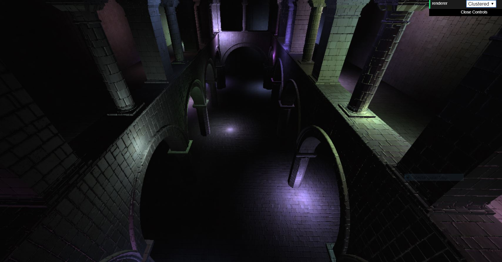
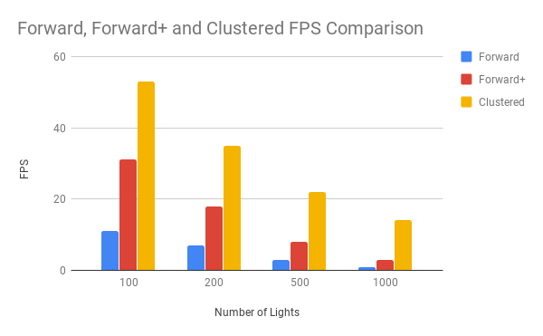

WebGL Clustered and Forward+ Shading
======================

**University of Pennsylvania, CIS 565: GPU Programming and Architecture, Project 5**

* Zach Corse
  * LinkedIn: https://www.linkedin.com/in/wzcorse/
  * Personal Website: https://wzcorse.com
  * Twitter: @ZachCorse
* Tested on: Windows 10, i7-6700HQ @ 2.60GHz 32GB, NVIDIA GeForce GTX 970M (personal computer)

### Live Online

## README

Introduction
------------
In this project I implement basic Forward+ and Clustered Deferred Shading and compare the performance difference between the two. Forward+ subdivides the camera frustum into equally proportioned clusters in the camera's x- and y- directions. Lights in the scene are binned into these clusters, such that fragments in these clusters are only shaded with the lights that have a chance of affecting their color.

Clustered shading further adds proportional slicing along the z-direction. Again, lights in the scene are binned into these (x,y,z) clusters. The clustered shading is deferred, in that it only computes fragment shading after the scene's depth and g-buffers are set.

Features
------------
1. Forward Shading
2. Forward+ Shading
3. Clustered Deferred Shading
4. Optimized G-Buffers
   * 1st G-Buffer stores [frag_position, normal.x]
   * 2nd G-Buffer stores [frag_color, normal.y]
   * Because the normal vector is normalized, normal.z can be computed in the deferred fragment shader

Performance
------------

We see in the graph below that clustered deferred shading does offer a consistent and considerable speedup over even forward+ shading, and also that forward+ shading is faster than the naive forward approach. All of the FPS values shown below are reported using the G-Buffer optimization highlighted in the Features section.

Reducing the number of G-buffers required from three to two does offer an observable difference in FPS. For 100 lights, clustered differed shading drops 10 FPS (from 53 to 43). The optmization, in this case, is passing normal.x with the position vector and normal.y with the color vector instead of passing each fragment normal in its own G-buffer.

### Credits

* [Three.js](https://github.com/mrdoob/three.js) by [@mrdoob](https://github.com/mrdoob) and contributors
* [stats.js](https://github.com/mrdoob/stats.js) by [@mrdoob](https://github.com/mrdoob) and contributors
* [webgl-debug](https://github.com/KhronosGroup/WebGLDeveloperTools) by Khronos Group Inc.
* [glMatrix](https://github.com/toji/gl-matrix) by [@toji](https://github.com/toji) and contributors
* [minimal-gltf-loader](https://github.com/shrekshao/minimal-gltf-loader) by [@shrekshao](https://github.com/shrekshao)
