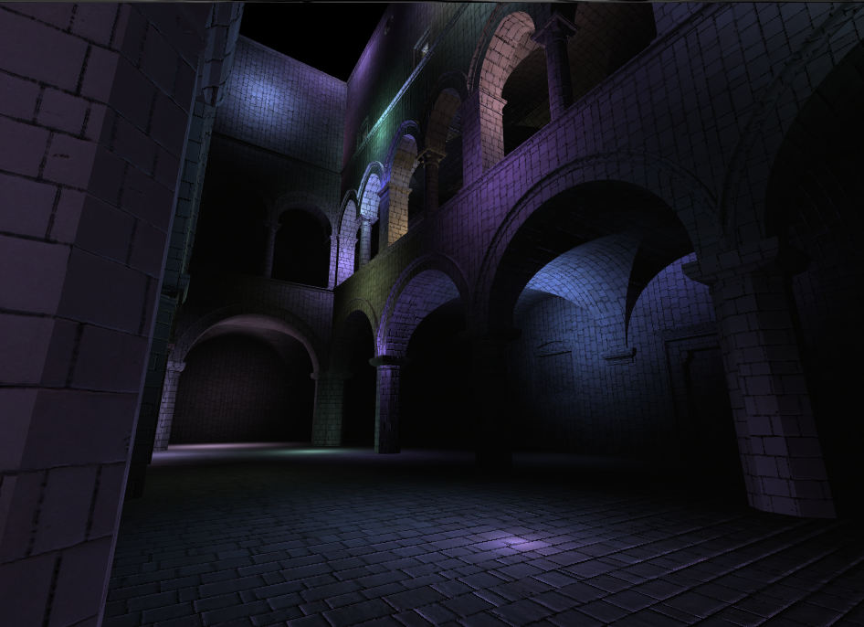
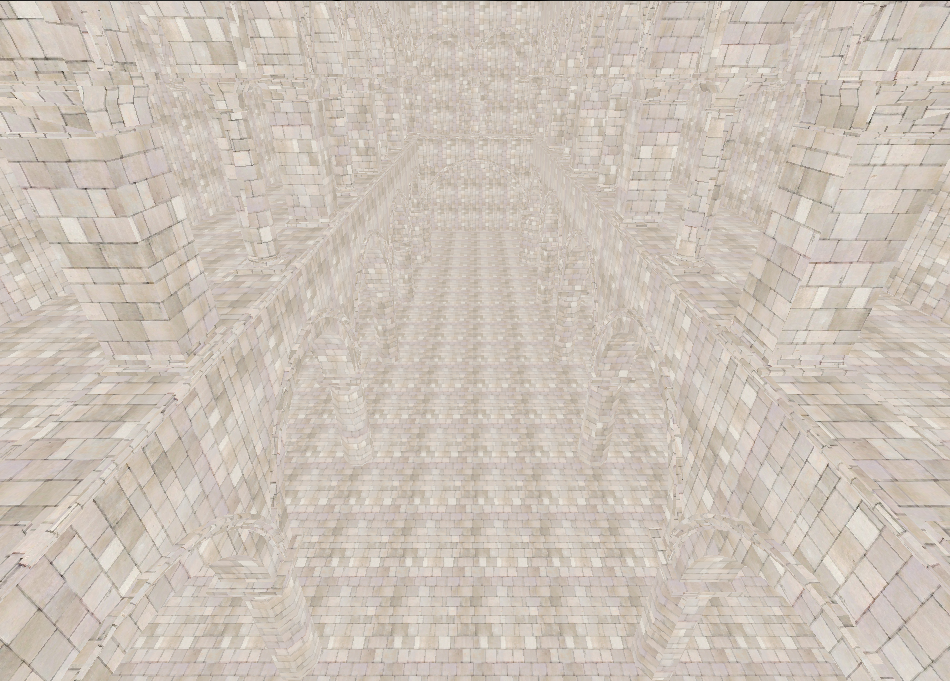
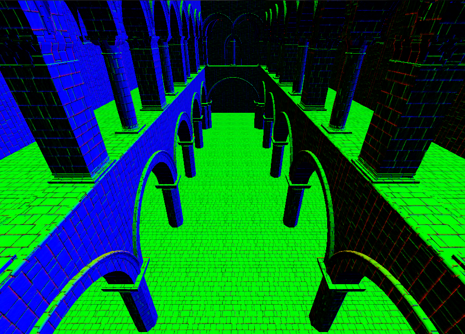
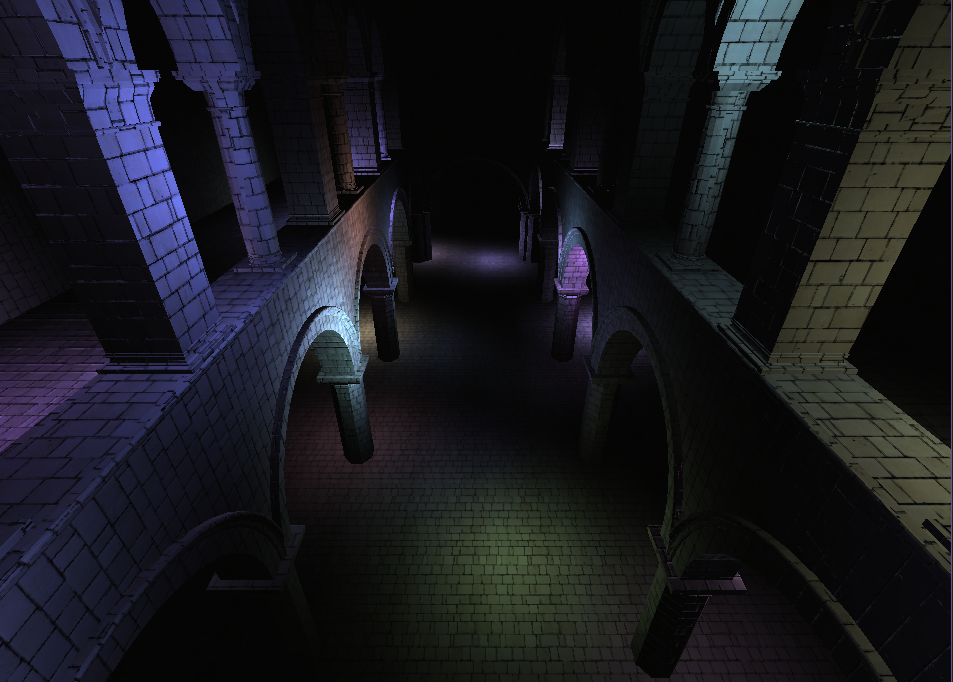
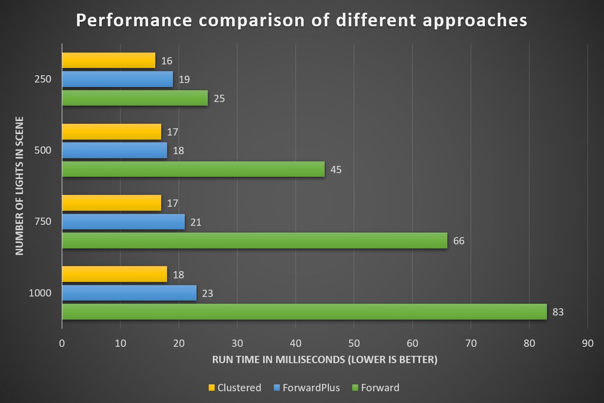

WebGL Clustered and Forward+ Shading
======================

**University of Pennsylvania, CIS 565: GPU Programming and Architecture, Project 5**

**Anantha Srinivas**
[LinkedIn](https://www.linkedin.com/in/anantha-srinivas-00198958/), [Twitter](https://twitter.com/an2tha)

**Tested on:**
* Windows 10, i7-8700 @ 3.20GHz 16GB, GTX 1080 8097MB (PC)

# ForwardPlus and Clustered Rendering

[](TODO)

### Live Online

[](http://TODO.github.io/Project5B-WebGL-Deferred-Shading)

# Introduction

In this project, I tackle the classical issue of working with lights in a graphical scene. 

## Forward (Naive) Rendering

In a single pass, naive approach, to render lights in a scene we would use the following algorithm.

```
foreach visible object
    foreach light affecting object
        calculate light contribution
```

We can clearly see that this approach is highly in-efficient with valuable GPU cycles spent unnecessarily going through all the lights, even those which are not anywhere near the object in question. 

## ForwardPlus Rending

ForwardPlus improves upon the naive approach by building a 3D frustrum of light information in camera view space. This frustrum is divided up into smaller slices in x, y and z. We then iterate through the lights in the CPU to determine the slices which it would affect. 

This frustrum is then passed to the GPU in form of a 2D texture. Now, in the fragment shader we can check the cell the fragment is in (after converting it to camera view space) and see the list of lights affecting it. 

This greatly improves the performance for these reasons:
* We are no longer considering lights which will not affect a object (especially great when the number of lights is very high in a very large scene).
* We are offloading the heavy computation to CPU which is better at the required calculations.
* It also reduces the number of shaders needed in the program.

## Clustered Rendering

Clustered Rendering improves upon the work done in ForwardPlus rendering to offer better flexiblity to the developer and make the render time faster.

It is structed mainly:

```
// First Pass
foreach visible object
    write positions, normals,.. etc to g-buffer

// Second Pass
foreach light
    compute light from g-buffer
    add to framebuffer    
```

Here the entire algorithm is split into two passes. In the first pass, we render positions, normals, depth, albedos and other information into multiple g-buffers or render targets. In the second pass, we read in from these multiple render targets and compute the final color with the ForwardPlus's light and cluster textures.

# Implementation

## ForwardPlus Rendering
 
 ForwardPlus implementation on the WebGL is summarized in these steps:
 * Create a Light texture
 * Create a Cluster texture
 * Update Cluster texture on CPU
 * Read Cluster and Light textures from fragment shader and compute new color



## Clustered Rendering

Clustered implementation in WebGL is similar to ForwardPlus and would involve all of the above steps. However, there are additional implementations:
* Iniitialize G-buffer (Render targets) one each for different components in lighting equation such as vertex positions, normals, albedo and depth.
* Render the scene in first pass to these G-Buffers.
* In second pass, perform ForwardPlus while reading in the above G-buffers.

The stages of the final render is shown below.

|| Albedo | Normal | 
|- | ------ | ------ | 
| First Pass|  |  |
| Second Pass|  |

# Performance Analysis

 
### Credits

* [Three.js](https://github.com/mrdoob/three.js) by [@mrdoob](https://github.com/mrdoob) and contributors
* [stats.js](https://github.com/mrdoob/stats.js) by [@mrdoob](https://github.com/mrdoob) and contributors
* [webgl-debug](https://github.com/KhronosGroup/WebGLDeveloperTools) by Khronos Group Inc.
* [glMatrix](https://github.com/toji/gl-matrix) by [@toji](https://github.com/toji) and contributors
* [minimal-gltf-loader](https://github.com/shrekshao/minimal-gltf-loader) by [@shrekshao](https://github.com/shrekshao)
