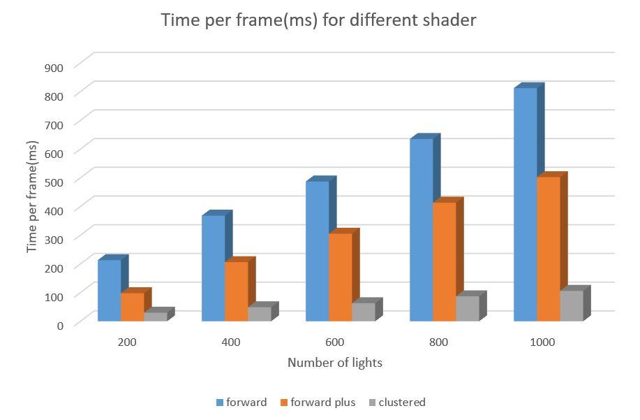

WebGL Clustered and Forward+ Shading
======================

**University of Pennsylvania, CIS 565: GPU Programming and Architecture, Project 5**

* Siyu Zheng
* Tested on: Windows 10, i7-6500 @ 2.50GHz 8GB, Intel(HD) Graphic 520

### Live Online

[Online video](https://youtu.be/1D61SnjGIGU)

Building up github page always throw error. Will add github page later. 

### Demo Video/GIF

Forward Plus shading GIF

Deferred shading GIF

### Features
* Create light cluster and update the TextureBuffer with a mapping from cluster index to light count and light list(indices).
* In Forward Plus shading, determine the cluster for a fragment, read in the lights in that cluster from the populated data, and do shading for just those lights.
* Write desired data to g-buffer, read values from the g-buffer and perform simple forward rendering. 

### Performance Analysis

According to the graph, we can see that clusterd deferred is much faster than forward shading and forward plus shading. Forward Plus is faster than normal forward shading. As the number of light grows, times for each frames also increase.

### Credits

* [Three.js](https://github.com/mrdoob/three.js) by [@mrdoob](https://github.com/mrdoob) and contributors
* [stats.js](https://github.com/mrdoob/stats.js) by [@mrdoob](https://github.com/mrdoob) and contributors
* [webgl-debug](https://github.com/KhronosGroup/WebGLDeveloperTools) by Khronos Group Inc.
* [glMatrix](https://github.com/toji/gl-matrix) by [@toji](https://github.com/toji) and contributors
* [minimal-gltf-loader](https://github.com/shrekshao/minimal-gltf-loader) by [@shrekshao](https://github.com/shrekshao)
