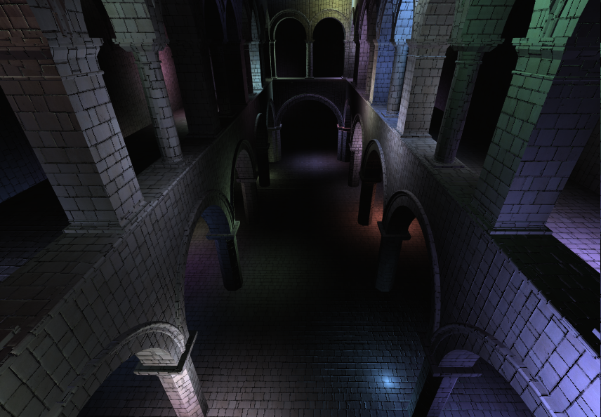
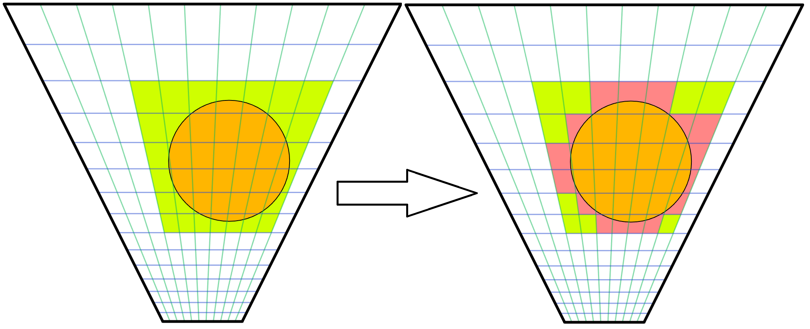
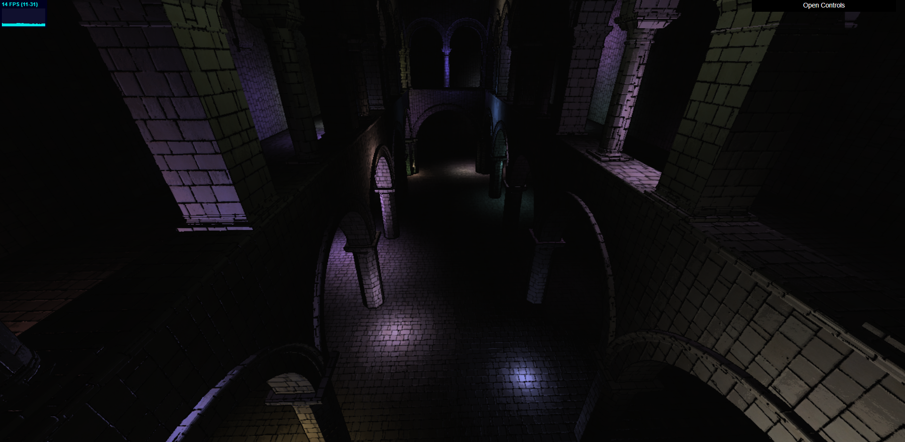
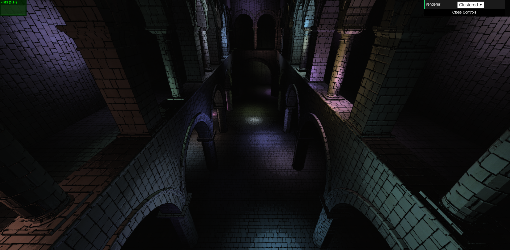
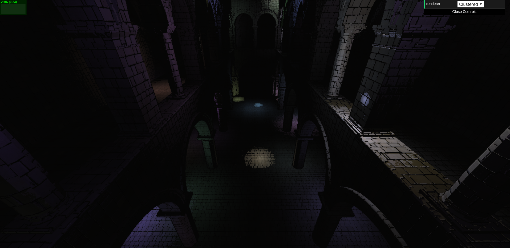
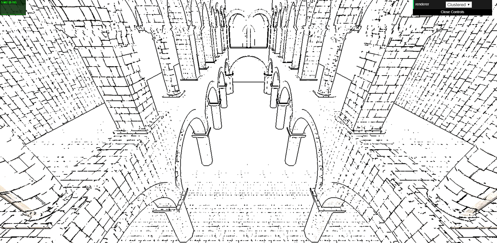
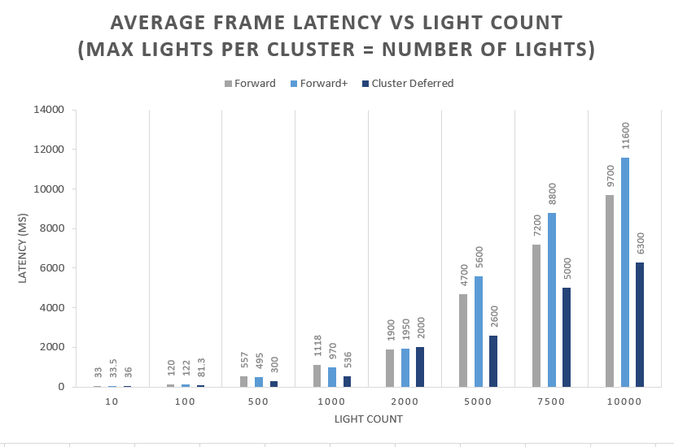
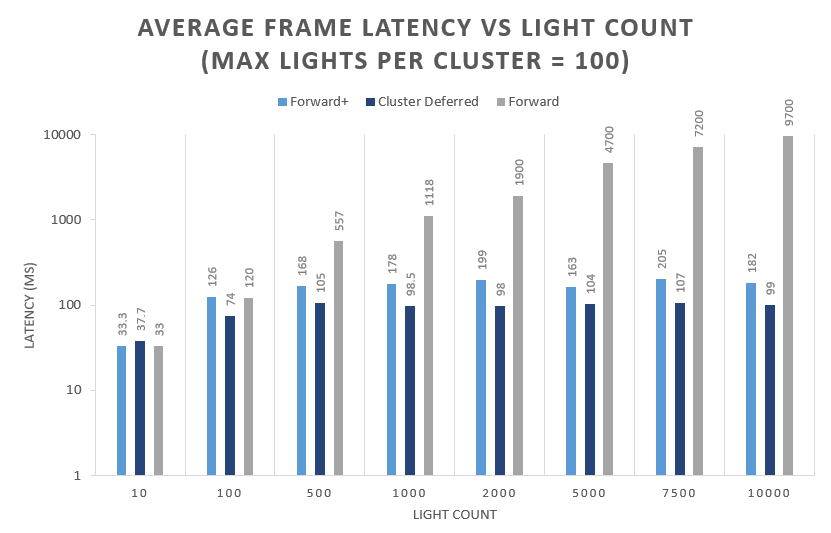

WebGL Clustered and Forward+ Shading
======================

**University of Pennsylvania, CIS 565: GPU Programming and Architecture, Project 5**

* Angelina Risi
  * [LinkedIn](www.linkedin.com/in/angelina-risi)
  * [Twitter](https://twitter.com/Angelina_Risi)
* Tested on: Windows 10, i7-6700HQ @ 2.60GHz 8GB, GTX 960M 4096MB (Personal Laptop)
    * Google Chrome Version 70.0.3538.77 (Official Build) (64-bit)


### Live Online

[](https://risia.github.io/Project5-WebGL-Clustered-Deferred-Forward-Plus/)

### Demo Video/GIF


## Rendering Techniques

### Forward+ Rendering
  
;
  
Forward rendering generally uses a single fragment shading pass to the framebuffer to render the scene. However, there are some inefficiencies in this method, such as requiring accounting for the influence of every single light in the scene. To mitigate some of this overhead, especially for scenes with large numbers of lights, Forward+ rendering divides the viewspace into chunks, referred to as clusters, in 3D space. The number of lights and their indices are stored in a buffer array per cluster. This method first of all culls the lights outside the view frustrum and second requires each fragment only loop over the lights influencing its cluster.  
After much trial and error, the method I settled on for light culling was starting with a 3D bounding box and narrowing down corners. Since the lights in this project are all spheres, we can generate the x, z, and z bounds in viewspace by transforming the light position and offsetting it by the light radius. Then, these bounds are transformed to cluster indices and we loop over the clusters in these bounds. For each cluster, I find the distance between its left-bottom-front corner and the light position. There is an error defined as the diagonal length of the cluster subtracted from this distance to determine whether the cluster could possibly be influenced by the light. This reduces some looping overhead from testing all eight corners of the cluster while still potentially reducing the number of redundant clusters from the bounding box corners.  
  

  
While researching this problem, many implementations I saw constructed clusters with their six bounding planes instead and used the normals for intersection tests. Having never used javascript before and being unsure exactly on how to implement it, I chose to implement the aforementioned vector comparisons instead. However, plane-based frustrums seems to be the accepted method and may possibly result in more efficient light culling.  
Furthermore, the light culling computations are currently done CPU-side by looping over each light. A GPU parallel implementation per-light would greatly reduce the  light buffer setup overhead expected.  
  
  
### Clustered Deferred Rendering  
  
;
  
Like the Forward+ case, we accumulate the lights per-cluster into the light buffer and pass it to the shader. Unlike the Forward case, deferred shading can use multiple fragment shading stages and outputs fragment attributes to several texture buffers called g-buffers.  
In this implementation, the first pass collects fragment attribute data, such as calculating the normals, and passes the information to the next shader pass through the buffers. Having these buffers instead of just passing only the fragment's info to the shader allows access to fragment data in the entire viewspace. This can be crucial for processing special effects reliant on other data on the screen.  
The current implementation uses three g-buffers, each storing an array of vec4 data. It passes four vec3 attributes: normal, color, world position, and view position. The view position is calculated here so it won't need to be recalculated in the following shader, and also just to fill the last values of the vec4's and show how extra information can be packed and retrieved without costing an extra buffer.  
  
```glsl  
gl_FragData[0] = vec4(norm, viewPos.x);
gl_FragData[1] = vec4(col, viewPos.y);
gl_FragData[2] = vec4(v_position, -viewPos.z);
``` 
```
 vec4 normal = texture2D(u_gbuffers[0], v_uv);
 vec4 albedo = texture2D(u_gbuffers[1], v_uv);
 vec4 v_position = texture2D(u_gbuffers[2], v_uv);
 vec3 pos = vec3(normal[3], albedo[3], v_position[3]);
 ```
  
The deferred rendering pipeline allows a little more control over the information processing, but I would assume there is some overhead to invoking a second shader to simply copy information, plus the memory cost of having multiple buffers saved.
  

### Toon Shading  
  
I implemented simple "toon" shading in the deferred fragment shader. The pixel albedo is quantized using integer division, causing gradients to be realized in color steps. This sharpens the shading and gives a sort of color-layer look. More quatization results in more contrast between lighting levels. In the two-step case, There are only three levels possible, so we can see up to three concentric color circles around where the lights are located.
  
Six-step quantization:  
  
 
  
Four-step quantization:  
   

   
Two-step quantization:  
  

  
Additionally, a simple algorithm was used to generate at least partial outlines to geometry on the screen. Because all the fragment data is stored in the g-buffers in the deferred shader, we can access the normals of neighboring pixels. If there is a significant change (dot product less than 0.2 is used as the threshold) with the neighboring normals, the shader will draw the pixel as black instead. This somewhat emulates the characteristic linework on edges expected of this style.  
  
An image was rendered without most lighting effects to clearly show an example of the outlines in the sample scene:  
  
  
  
The outline is most clear in defining different neighboring geometries, such as the columns againt the floor, but also shows the stone texturing from the normal mapping.  
A more accurate version of this technique would also reference the depth of neighboring pixels to determine outlines. Some of the pillars have similar edge normals to the walls neighboring in screenspace, leaving their outlines only partially defined, but comparing their z positions in viewspace could potentially resolve this.

  
  
## Performance Analysis  
  
I compared the average latency per frame between the three methods. The measurement in the top left corner of the screen turned out to be unreliable, for example saying only 1ms when the program was clearly severly slowed down. Instead, I used Google's built-in DevTools to run a performance analysis. In this analysis is a timeline including all the times for a frame to render. I added the number of frame transitions and divided the simulation time by this to get a rough estimate of the average frame delay for each case.
  
### Light Cluster Culling  
  
The light culling is very compute heavy, and by all means should be moved to a GPU implementation to run parallel. In fact, some of my measurements showed the compute time as a major bottleneck.  
  
  
  
If the max lights per cluster is only bounded by the number of lights, the lights are only culled by cluster binning, which as mentioned is resource and compute expensive task. There is likely some optimal number of lights per cluster for accuracy in rendering a scene while still improving speed. This would also need to balance with the amount of world space contained within each cluster compared to the size of the lights. When the max lights per cluster is reduced back down to 100, there is significant improvement in the framerate.  
  
  
    
Since the light culling pass does not need to do additional computations or memory access with a cluster if it is full, this saves significant compute time. This limit would be more easily checked if we looped through the clusters first instead of the lights, saving the trouble of computing the light bounding box, as all that is needed is accessing and checking one buffer value.  
  
### Deferred vs Forward Shading
  
You may have noticed from the plots that in the same conditions the deferred shader seems to have lower latency than the Forward+ renderer. This is in spite of identical light-culling functions. Apparently the fist fragment shader pass ensures that only one fragment per pixel is being rendered in the final image. This can significantly reduce the number of pixels being shaded in a complex scene, so each light is only used once per pixel.  
The tradoff, as mentioned previously, is the g-buffers needing to store a screen-sized texture each, adding to memory overhead. Additionally, while the g-buffers make it easier to share attribute data between fragments, and thus enables certain techniques, deferred shading limits the ability to do others. Rendering different materials, transparency, and anti-aliasing are supposed to be more difficult to implement if possible at all.
  
### Feature Overhead  
  
I attempted to compare the speed of the deferred renderer with and without the extra light corner culling step and the toon shading.
   
  
  
Under the conditions used, the slowdown from this extra functionality seems minimal. The corner checking only occurs if the cluster isn't full and the cluster is in the bounding box, so even in a scene with dense lighting only a fraction of cases go through this extra step. The toon shading does require extra steps to compute, retrieve or compare values in the fragment shader, but since many pixels are being processed at once, in parallel, the effects on the delay become almost trivial.
  
### G-Buffer Setup  
  
Compacting fragment data for the shader into as little buffer space as possible has the added benefits of reducing memory usage and the number of memory accesses necessary to retrieve this info. It is posible to compact certain data further, such as the normal to two components, but this then may require extra overhead in re-computing the missing component. Thus, the g-buffers require optimization between memory overhead and compute overhead. A compute operation is generally cheaper than a memory transfer. 
  
### Credits

* [Three.js](https://github.com/mrdoob/three.js) by [@mrdoob](https://github.com/mrdoob) and contributors
* [stats.js](https://github.com/mrdoob/stats.js) by [@mrdoob](https://github.com/mrdoob) and contributors
* [webgl-debug](https://github.com/KhronosGroup/WebGLDeveloperTools) by Khronos Group Inc.
* [glMatrix](https://github.com/toji/gl-matrix) by [@toji](https://github.com/toji) and contributors
* [minimal-gltf-loader](https://github.com/shrekshao/minimal-gltf-loader) by [@shrekshao](https://github.com/shrekshao)
