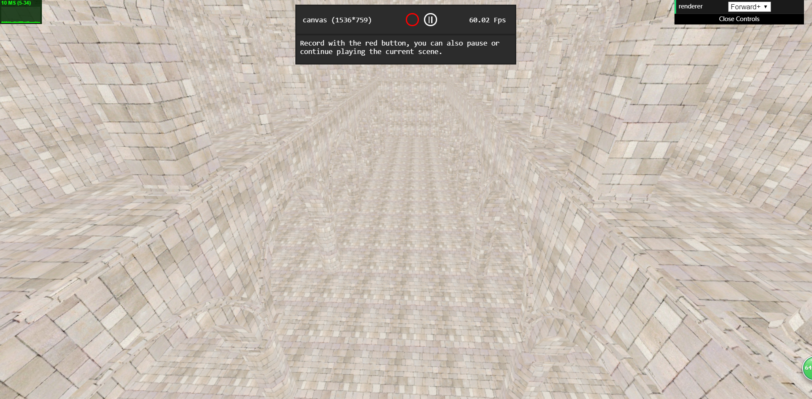
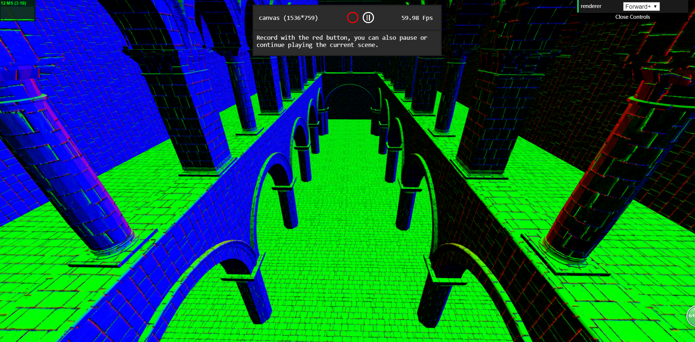
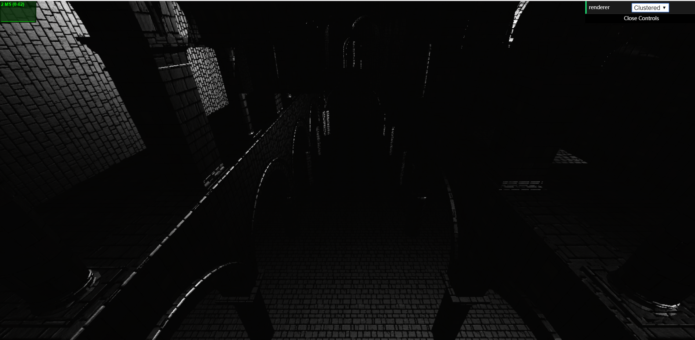
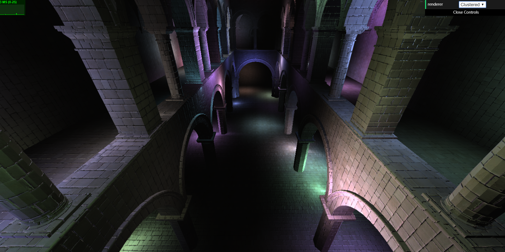
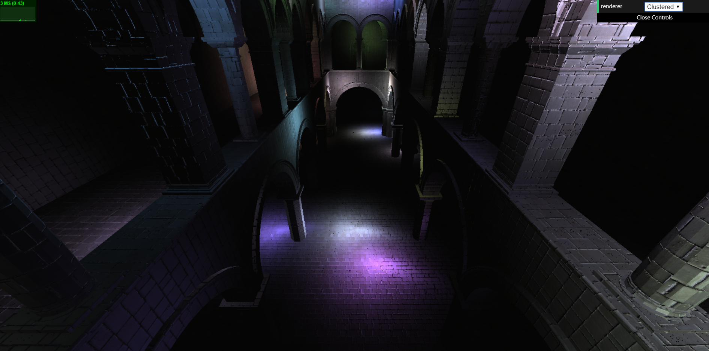
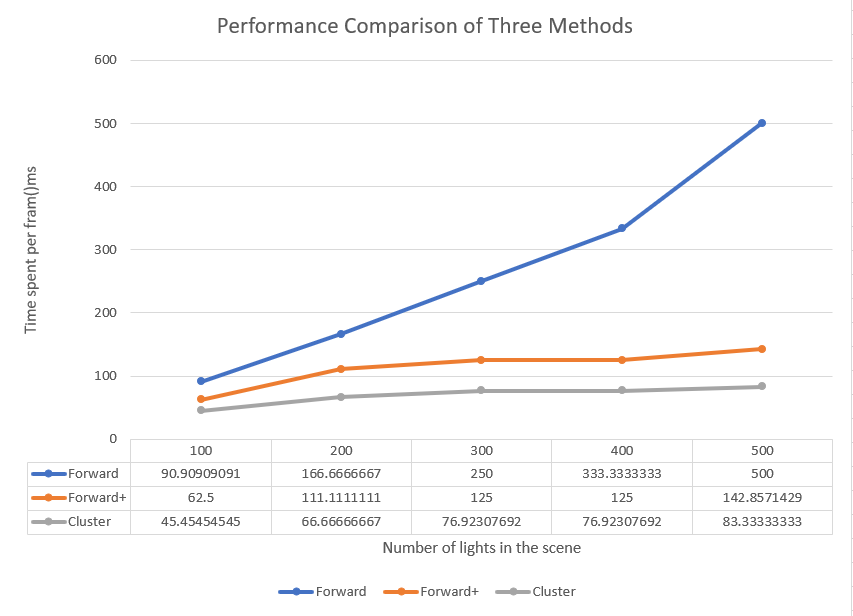
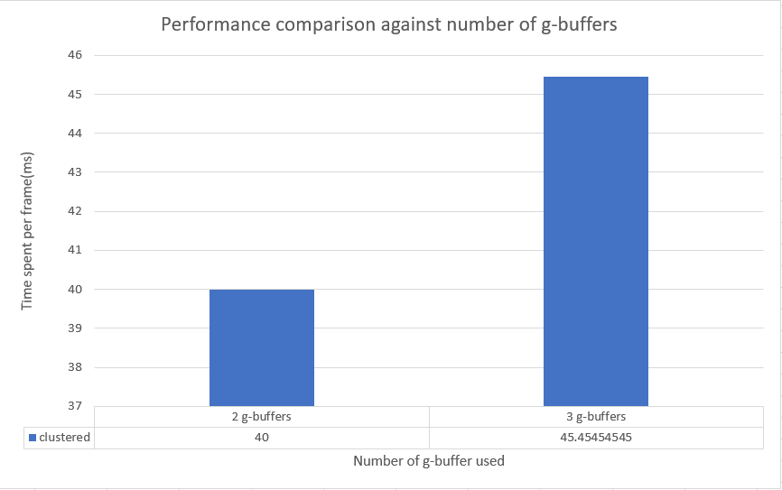

WebGL Clustered and Forward+ Shading
======================

**University of Pennsylvania, CIS 565: GPU Programming and Architecture, Project 5**

* Yuru Wang
* Tested on: **Google Chrome 62.0.3202.94** on
Windows 10, i7-7700HQ @ 2.5GHz 128GB, GTX 1050 Ti 8GB (personal computer)

### Live Online

### Demo Video/GIF

## Project Description ##
This project implements forward shading, clustered foward+ shading, and clusterd deferred shading using webgl. For the forward+ and deferred shading, the lights information in the scene is stored in a texture which is used in final rendering. Apart from the three different rendering piple lines, lambertion shading and blinn-phong shading are also implemented in this project.

A list of features implemented in this project is as follows:
* Forward+ rendering: Built a data structure to keep track of how many lights are in each cluster and what their indices are
Render the scene using only the lights that overlap a given cluster
* Clustered deferred rendering: Stored vertex attributes in g-buffer. Read g-buffer in a shader to produce final output.
* Blinn-Phong shading: Combined diffuse color and specular color.
* Optimized g-buffer format: Packed color, vertex position, normal values together into vec4s. Used 2-component normals and calculate the third component in shader.

## Results ##
**Lambertion vs Blinn-Phong**

**g-buffers**

| albedo | normal | specular |
|------|------|------|
|  |  |  |

**g-buffer format optimization**

| 3-component-normal | 2-component-normal |
|------|------|
|  |  |

## Performance Analysis and Questions ##

From the figure above we can clearly see the performance difference among forward, forward+, and clustered deferred. Forward uses much more time than the other two because for every geometry and every light in the scene it has to perform light calculation on them, whereas forward+ and deferred cluster only take lights that influence the geometry into account. When the number of lights increases, the performance difference between Forward+ and clustered deferred becomes more obvious because deferred cluster shading eliminates the light calculation of occluded geometry and when the number of lights is huge, forward+ would spent far more time on doing light calculation than deferred clustered.

In the case of 2 g-buffers, albedo color and normal.x is stored in g-buffer[0], and vertex position and normal.y is stored in g-buffer[1]. In the case of 3 g-buffers, albedo color, vertex position and normal are stored in 3 g-buffers respectively. It can be observed from the figure that the performance of using 2 g-buffers is much better than using 3 g-buffers because there will be less texture reading and writing. By using 2 g-buffers, 2-component-normal is stored, and the third component is calculated in final rendering, which will introduce float point errors and the normal is distorted to some degree. The minor difference could be observed in the screen shot in last section.

### Credits

* [Three.js](https://github.com/mrdoob/three.js) by [@mrdoob](https://github.com/mrdoob) and contributors
* [stats.js](https://github.com/mrdoob/stats.js) by [@mrdoob](https://github.com/mrdoob) and contributors
* [webgl-debug](https://github.com/KhronosGroup/WebGLDeveloperTools) by Khronos Group Inc.
* [glMatrix](https://github.com/toji/gl-matrix) by [@toji](https://github.com/toji) and contributors
* [minimal-gltf-loader](https://github.com/shrekshao/minimal-gltf-loader) by [@shrekshao](https://github.com/shrekshao)
