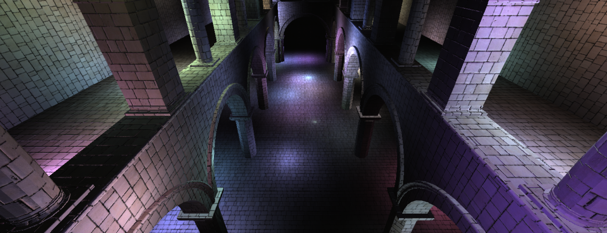
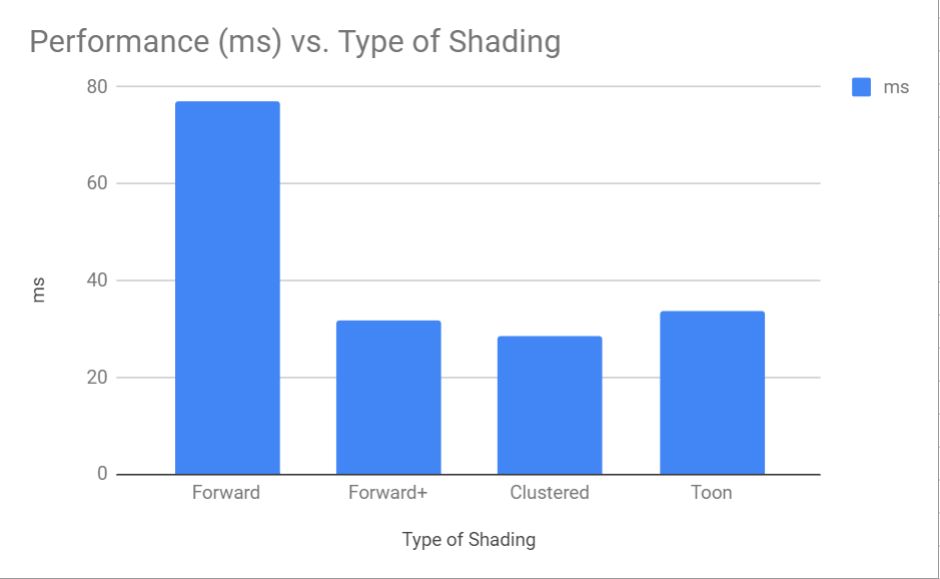
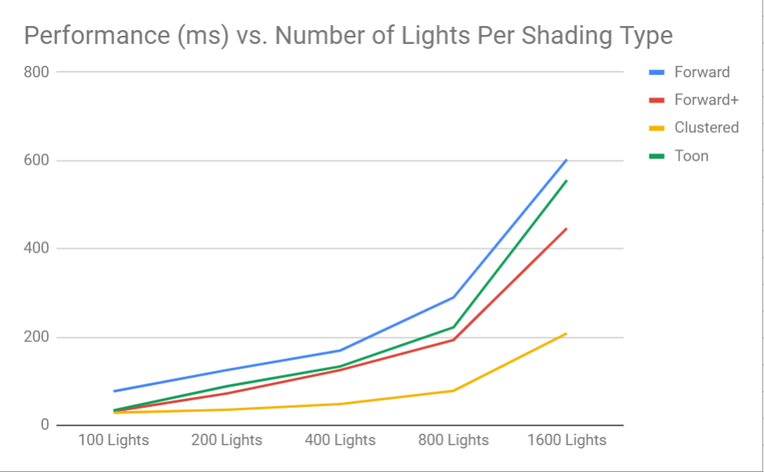
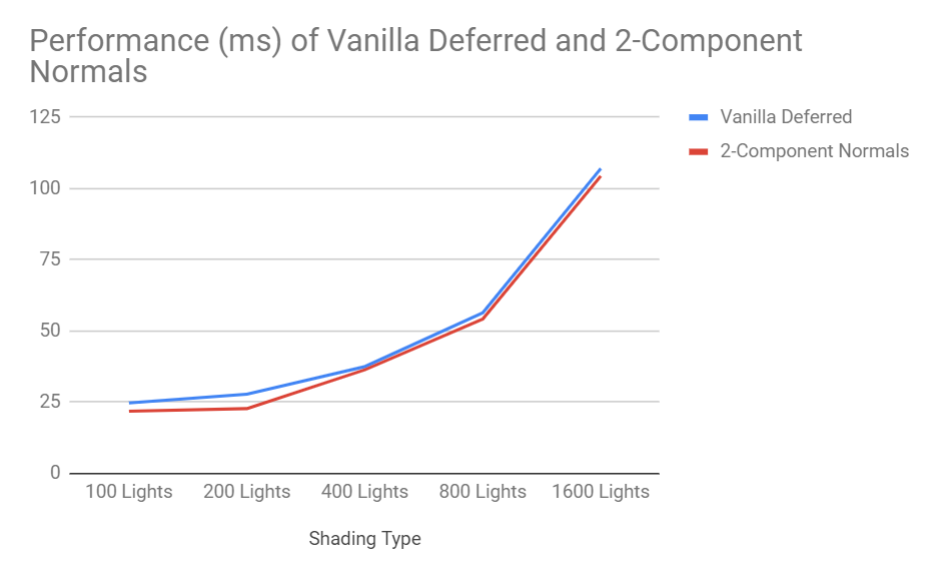

WebGL Clustered and Forward+ Shading
======================

**University of Pennsylvania, CIS 565: GPU Programming and Architecture, Project 5**

* Emily Vo
  * [LinkedIn](linkedin.com/in/emilyvo), [personal website](emilyhvo.com)
* Tested on: Windows 10, i7-7700HQ @ 2.8GHz 16GB, GTX 1060 6GB (Personal Computer)

### Live Online

### Demo Video/GIF

### Project Overview
An implementation of forward rendering, forward clustering, and forward clustering with toon shading effects. 

Forward rendering is often optimizes by limiting the number of lights in the scene. To optimize a rasterization pipeline for a scene with thousands of lights, one can consider using either deferred clustering or forward clustering.

Deferred shading rasterizes the image into a series of 2D images that store the geometry information for lighting computations in a second pass. These buffers can contain position, color, normal, and depth values. This collection of buffers is referred to as the Geometric buffer (G-Buffer for short). In the lighting pass, each pixel that is touched by the light, represented as a geometric object, is shaded using lambert's computation. Deferred shading's advantage is that expensive lighting is computed once per light per affected pixel. One of the disadvantages of deferred shading is that it can only handle opaque objects, since multiple transparent objects can cover the same screen pixels, but it is only possible to store a single value per pixel in the g-buffers.

Forward+ combines forward rendering with tiled light culling to reduce the number of lights considered in shading computations per pixel. Forward+ culls the lights then forward renders. The first pass partitions the lights into per-tile lists. The second pass shades the pixel using the list of lights in the grid that was computed in the previous pass. It greatly reduces the number of lights iterated over per pixel because there are many lights in the scene that do not affect that pixel. Opaque and transperent geometry can be handled in Forward+ rendernig.

### Features
#### 2-Component Normals
 
In the gif above, the appearance and performance of 2-component normals is compared to vanilla deferred shading. It is clear that there is a loss of information when switching to the deferred shading that utilizes the two-component model, with only a slight increase in performance. The deferred shading model has about 34 FPS where as the two-component normal deferred shading has about 38 FPS.

#### Toon Shading Effects

I implemented toon shading as an extension of forward+ shading. I ramped the color by multiplying the color by 3.0, flooring the result, and then multiplying by 3 again. This creates the appearance of more distinct color regions. Finally, for simple edge detection, I tested if the dot product between the vector from the position to the camera and the normal was below a certain theshold. If it was, then I would change the fragment color to black. If the dot product was lower, that means the vectors were pointing in dissimilar directions, so it would be a position on the edge. I did not experience a huge performance hit since it was a few additional floating point operations.

#### Performance Analysis

The results shown in the graphs are as expected. Forward rendering is greatly hindered as the number of lights double from test to test. The frame computation time increases almost exponentially. Forward+ rendering is consistently better performance, but also decreases performance greatly as the number of lights double in the scene. Toon shading is an extension of Forward+ in my project, so it is affected by the number of lights in similar ways. Deferred shading handles the increase in lights very well, and maintains decent performance even with 1600 lights in the scene. The frame computation rate grows the slowest with deferred shading. Forward rendering tends to be slower because the fragment shader may be processing fragments that do not show, and deferred shading writes and uses information that is guarenteed to be rendered.

For two-component normals, the results in the graph are as expected - two-component normals has a performance boost. You save memory by removing an entire g-buffer. In terms of run-time, it is faster to perform the math to decode the normal than reading from a texture in the case of cache misses where we can lose many cycles searching for the right value in physical memory. 

### Credits
* [Three.js](https://github.com/mrdoob/three.js) by [@mrdoob](https://github.com/mrdoob) and contributors
* [stats.js](https://github.com/mrdoob/stats.js) by [@mrdoob](https://github.com/mrdoob) and contributors
* [webgl-debug](https://github.com/KhronosGroup/WebGLDeveloperTools) by Khronos Group Inc.
* [glMatrix](https://github.com/toji/gl-matrix) by [@toji](https://github.com/toji) and contributors
* [minimal-gltf-loader](https://github.com/shrekshao/minimal-gltf-loader) by [@shrekshao](https://github.com/shrekshao)
