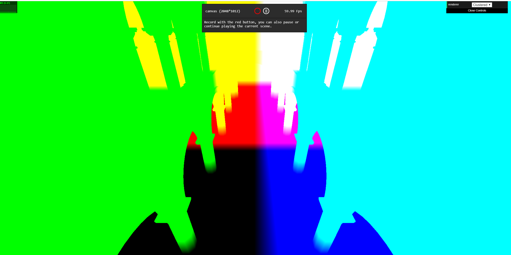
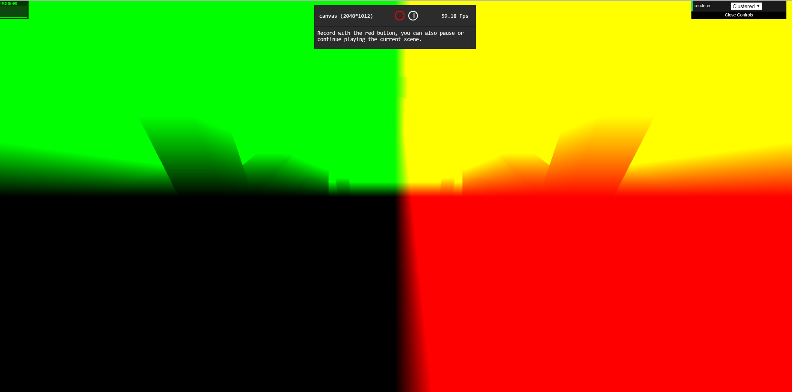

WebGL Clustered and Forward+ Shading
======================

**University of Pennsylvania, CIS 565: GPU Programming and Architecture, Project 5**

* Wanru Zhao
* Tested on: Google Chrome 70.0.3538.77 on
  Windows 10, i7-8750H @ 2.20GHz 16GB, GTX 1070 with Max-Q Design (Personal Laptop)

### Live Online

_Currently having issue with making github pages (npm run build issue)_

### Demo Video/GIF

  

### Features

- Cluster update
  - Devide the whole frustum into **_xSclices * _ySlices * _zSlices** clusters and assign lights into overlapping clusters
- Foward+
  - Build a data structure (texture buffer) to keep track of how many lights are in each cluster with their indices
  - Render the scene using only the lights that overlap a given cluster
- Clustered
  - Reuse clustering logic
  - Store vertex attributes in g-buffer
  - Read g-buffer and render scene to produce final output
- Effect
  - Implemented deferred Blinn-Phong shading for point lights
- Optimization
  - Reduce number of g-buffers from 4 to 2, reconstructing world position using camera matrice and (gl.FragCoord.x, gl.FragCoord.y, depth)
  
### Effect
#### Blinn-Phong shading

  

### Analysis

#### Clustered deferred rending components
Albedo | Normal
:--:|:--:
|
Depth | World Position
|
Camera Position

_Those are components used to final shading in deferred rendering. Among them, albedo, normal and depth are passing through g-buffers, while world position and camera position are reconstructed from information obtained from g-buffers._

#### Performace
##### Performance comparison of Forward, Foward+ and Clustered methods

##### Performace comparison of unoptimized Clustered and optimized Clustered

### Credits

* [Three.js](https://github.com/mrdoob/three.js) by [@mrdoob](https://github.com/mrdoob) and contributors
* [stats.js](https://github.com/mrdoob/stats.js) by [@mrdoob](https://github.com/mrdoob) and contributors
* [webgl-debug](https://github.com/KhronosGroup/WebGLDeveloperTools) by Khronos Group Inc.
* [glMatrix](https://github.com/toji/gl-matrix) by [@toji](https://github.com/toji) and contributors
* [minimal-gltf-loader](https://github.com/shrekshao/minimal-gltf-loader) by [@shrekshao](https://github.com/shrekshao)
