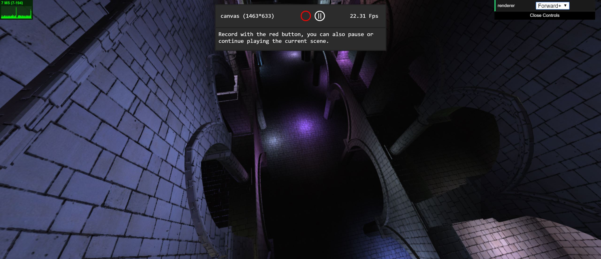
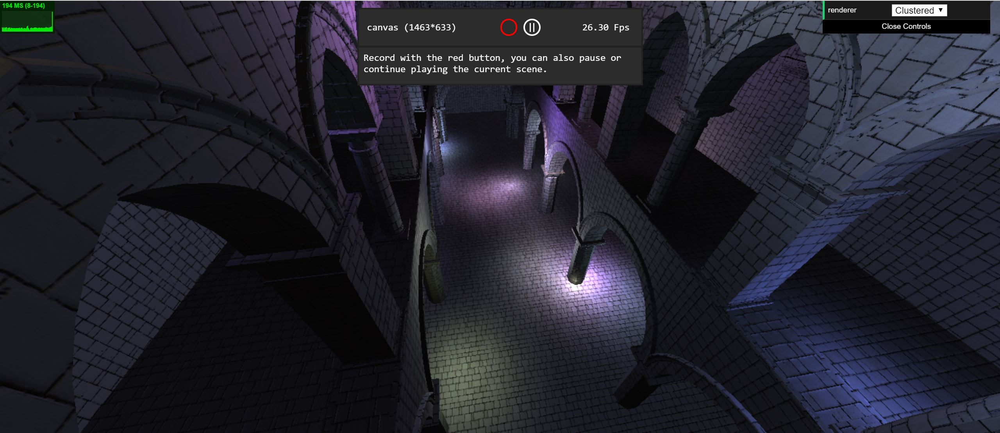
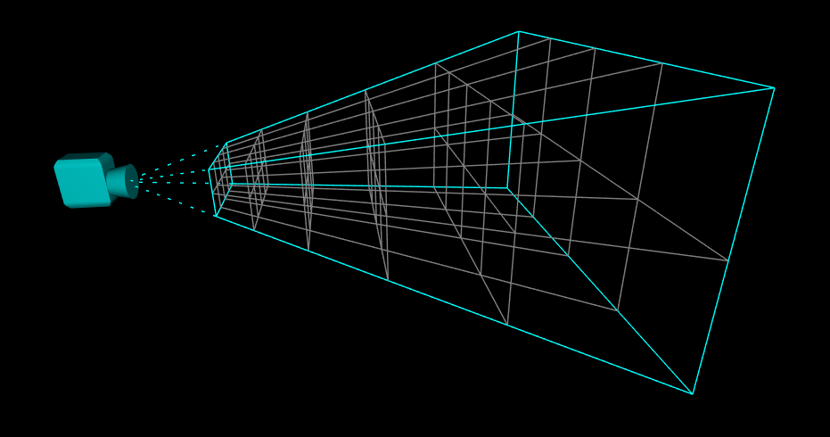
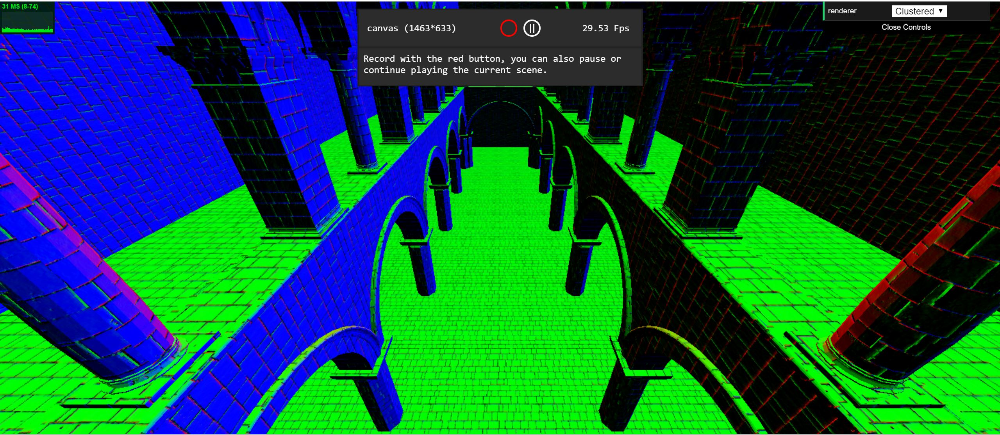
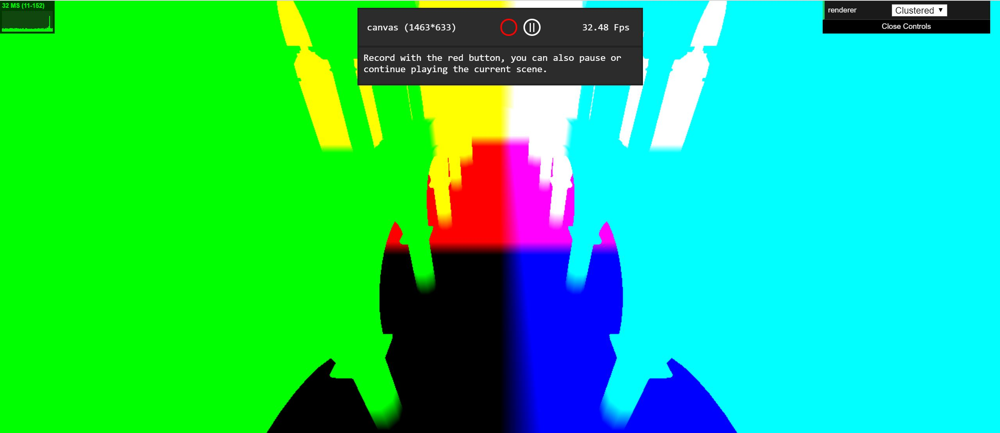
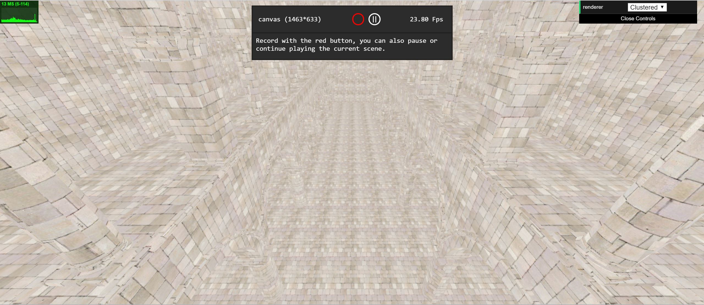
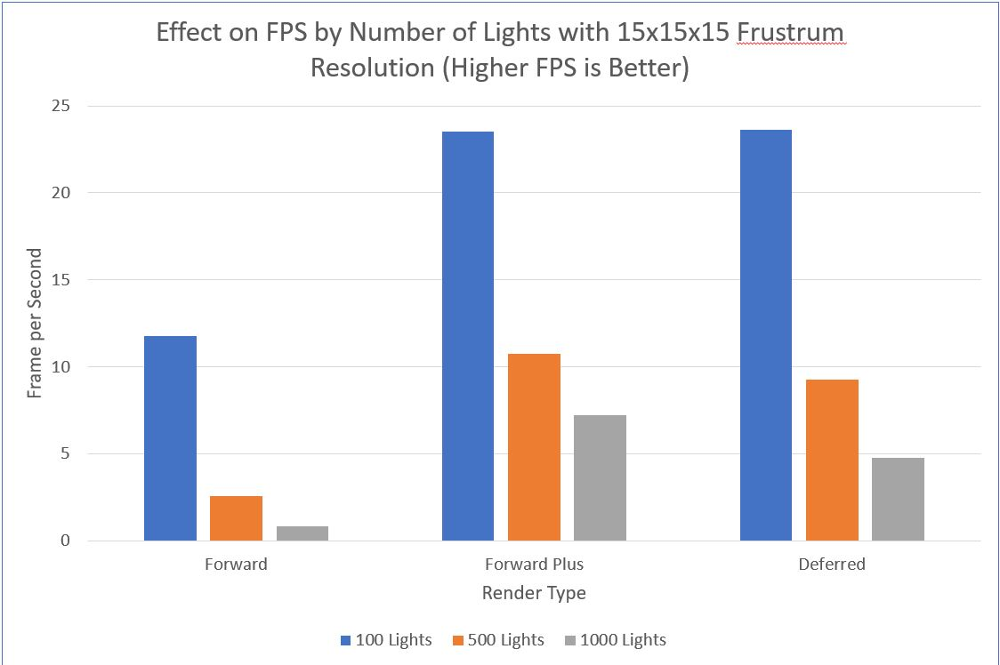
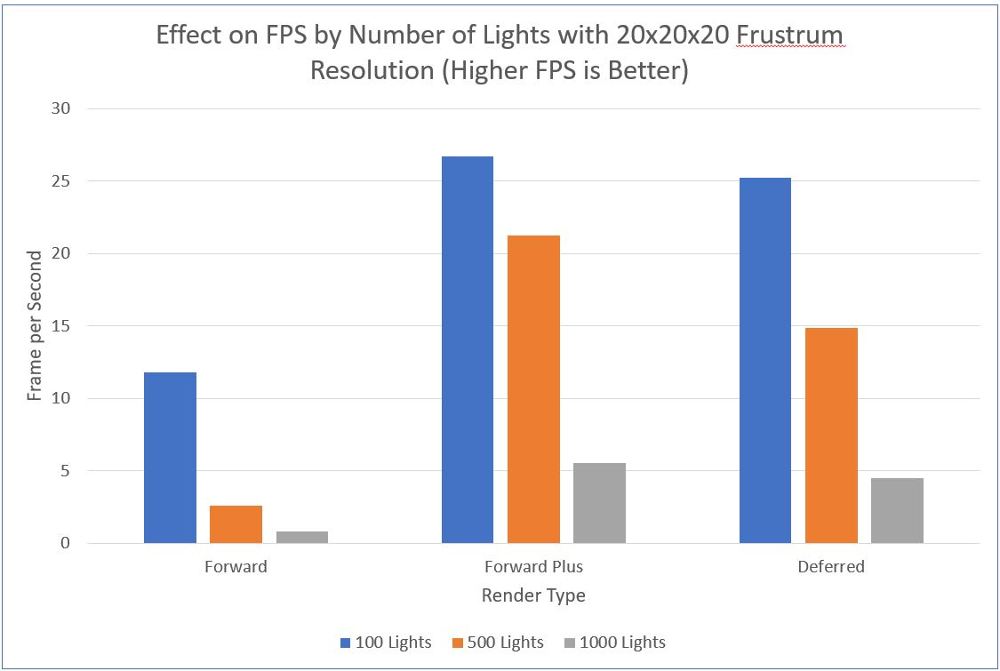
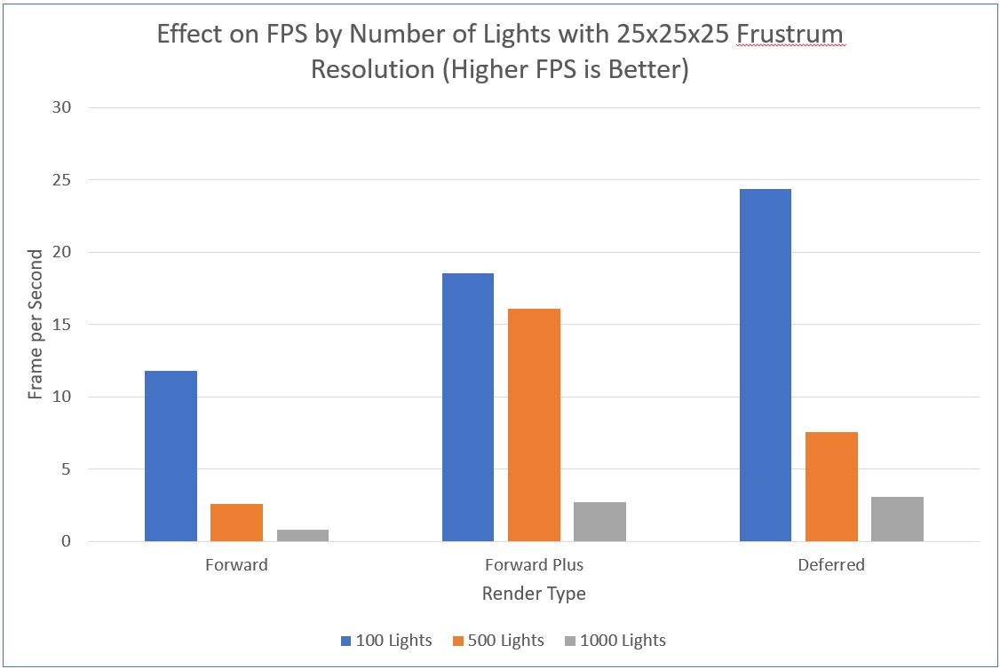

WebGL Clustered and Forward+ Shading
======================

**University of Pennsylvania, CIS 565: GPU Programming and Architecture, Project 5**

* Ishan Ranade
* Tested on personal computer: Gigabyte Aero 14, Windows 10, i7-7700HQ, GTX 1060

## Images

* Forward Plus

* Deferred

## Live Online

[Demo Link](https://ishanranade.github.io/Project5-WebGL-Clustered-Deferred-Forward-Plus/)

## Demo Video/GIF

## Forward Plus

Forward plus shading is a technique in which you perform forward rendering, but you use clustering to greatly improve performance.  Clustering is a technique where you divide up the view frustrum portion from the near clip plane to the far clip plane into "fruxels", or frustrum voxels.  You then figure out which lights affect which fruxel, and save this data into a texture.  You can then unpack this texture during the lighting stage of the shader and perform lighting only using the lights that affect the fruxel that a fragment is in.

- Example of how the fruxels look

## Effects

For Forward Plus I used basic lambert shading, but for the Deferred renderer I used Blinn Phong shading to add some specular information to the scene.  You can see from the two images at th very beginning of the README or the demo gif the difference between the shading.  You will notice that the Deferred renderer appears to make the scene brighter.

## Deferred

Deferred shading is a technique where you have an extra pass in between the typical vertex and fragment shaders in which you render fragment data to a series of textures and use those textures in the final fragment shader.  These textures are usually known as g-buffers, and eac g-buffer holds unique data.  Deferred rendering can also make use of clustering to improve performance.  Below are examples of the various textures that we can output to the final stage and the type of data each represents.

- Normals

- World positions

- Albedo colors

## Optimizations

Some optimizations I used include packing data in the G buffers to save memory.  I needed the view space position for my final shading calculations, so I stored each element as the 4th components of each of the 3 g-buffers that I used.  This helped me reduce to only using 3 g-buffers.  Reducing the number of g-buffers is important because it reduces the amount of memory that must be created to fill a texture and pass it on to the final fragment stage.  The less g-buffers needed the less memory that must be stored on the GPU.

There were a couple optimizations I tried to use for the g-buffers as illustrated in this table with their effects on FPS specifically for Deferred shading.

#### Reduce G-Buffers to 3 

- Top row is the resolution of how the frustrum was sliced up

|             | 15x15x15  | 20x20x20  | 25x25x25  | 
| ----------  | --------- | --------- | --------- |
| 100 Lights  | 23.25 FPS | 25.12 FPS | 16.22 FPS |
| 500 Lights  | 10.34 FPS | 13.98 FPS | 6.43 FPS |
| 1000 Lights | 7.82 FPS  | 4.44 FPS  | 4.68 FPS |

#### Use 2 Component Normals

- Top row is the resolution of how the frustrum was sliced up

|             | 15x15x15  | 20x20x20  | 25x25x25  | 
| ----------  | --------- | --------- | --------- |
| 100 Lights  | 22.12 FPS | 26.14 FPS | 18.40 FPS |
| 500 Lights  | 11.48 FPS | 13.30 FPS | 6.82 FPS |
| 1000 Lights | 7.45 FPS  | 5.78 FPS |  5.15 FPS |

It seems as though these optimizations had very limited effects compared to the unoptimized versions as can be seen by comparing these tables to the performance graphs below.

## Performance Analysis

During my experimentation, I found that my computer was limited in the size of memory that I could store on the GPU, and I was only able to have a resolution of 25x25x25 for the cluster texture.  I perfomed experiments on various cluster resolution sizes and light counts to see how fast each type of rendering could perform.

I found that Deferred rendering tended to be the fastest, which became more visible the more lights I added to the scene.  This may be because forward plus shading does not have to push extra g-buffers on to the GPU, so it scale well as all that increases is the cluster buffer size.  Unfortunately, my implementations of the renderers did not scale very well with increasing light counts and the FPS dramatically decreased.  This is probably because I did not split up the fruzels very well and chose a linear split along the x, y, and z axes.  There are more efficient splits to try to have finer resolutions closer to the near clip and coarser ones as you approach the far clip since there will be less content near the far clip.  I may have also been able to reduce g-buffer sizes even more by not using floats and perhaps using smaller data types, though that would have cost accuracy.

### Credits

* [Three.js](https://github.com/mrdoob/three.js) by [@mrdoob](https://github.com/mrdoob) and contributors
* [stats.js](https://github.com/mrdoob/stats.js) by [@mrdoob](https://github.com/mrdoob) and contributors
* [webgl-debug](https://github.com/KhronosGroup/WebGLDeveloperTools) by Khronos Group Inc.
* [glMatrix](https://github.com/toji/gl-matrix) by [@toji](https://github.com/toji) and contributors
* [minimal-gltf-loader](https://github.com/shrekshao/minimal-gltf-loader) by [@shrekshao](https://github.com/shrekshao)
