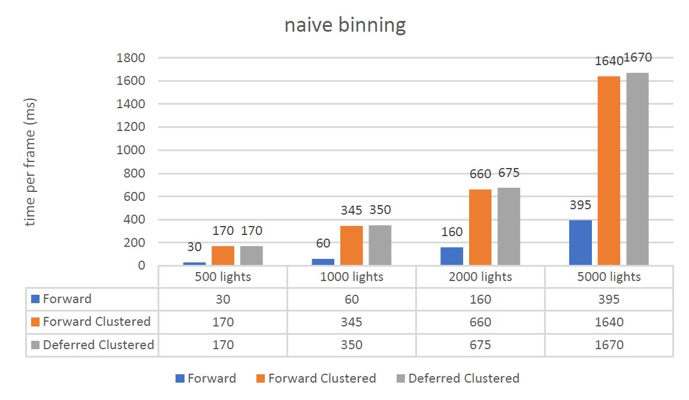
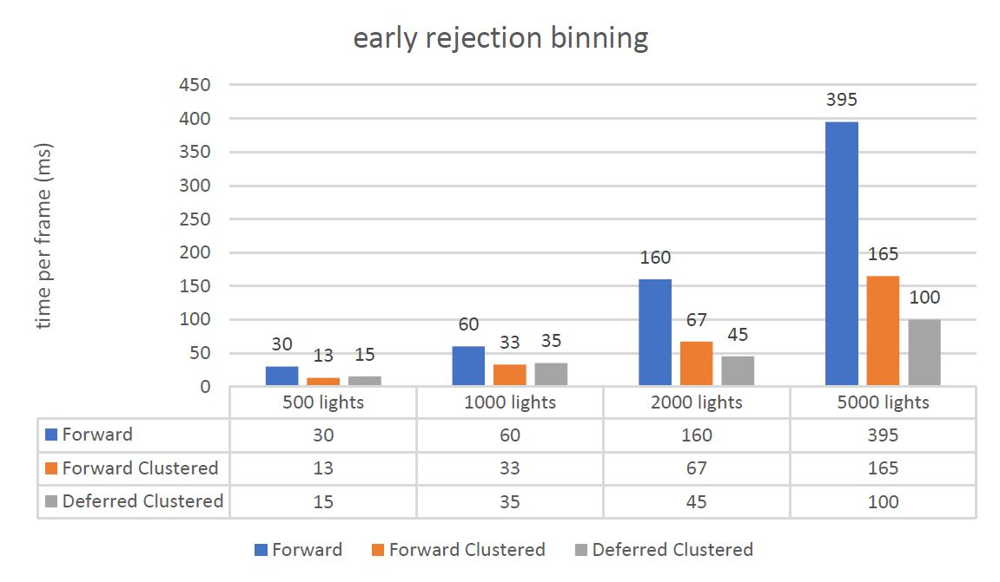
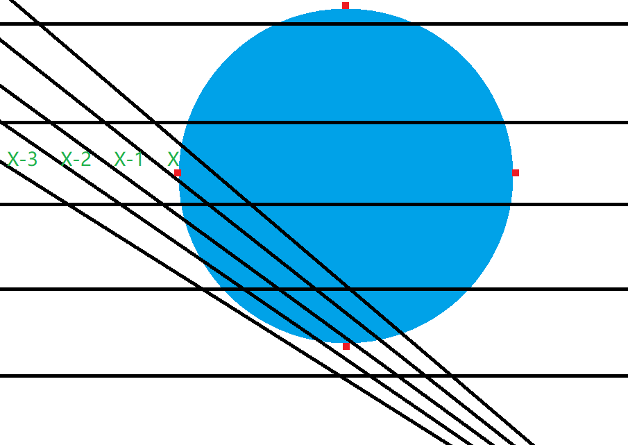
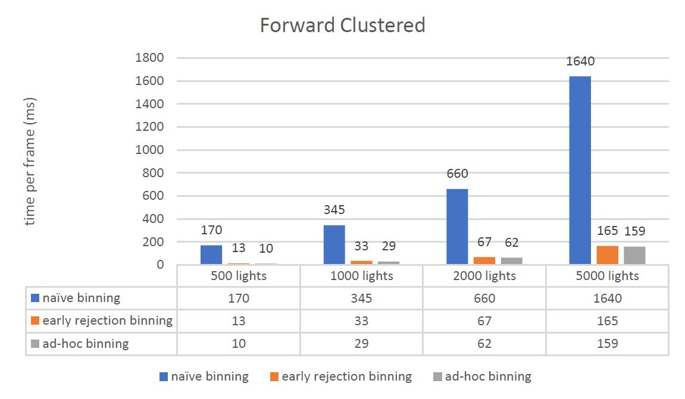
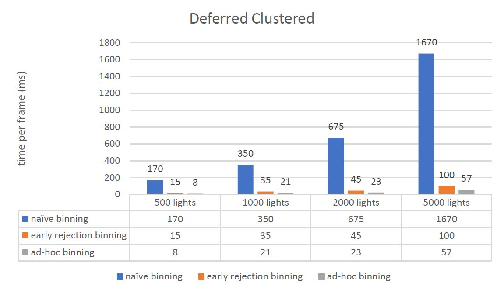
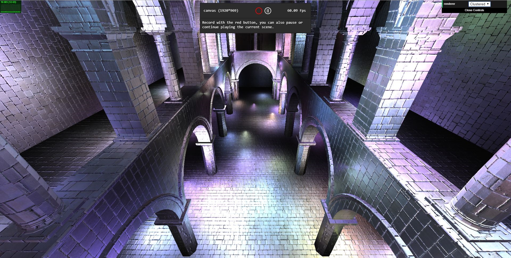

WebGL Clustered and Forward+ Shading
======================

**University of Pennsylvania, CIS 565: GPU Programming and Architecture, Project 5**

* Xiao Zhang
  * [LinkedIn](https://www.linkedin.com/in/xiao-zhang-674bb8148/)
* Tested on: Windows 10, i7-7700K @ 4.20GHz 16.0GB, GTX 1080 15.96GB (my own PC)

Analysis 
======================
* MAX_LIGHTS_PER_CLUSTER is always NUM_LIGHTS;

* Rendering time is measured in milisecond, so lower is better.

---

## 1. Comparison between Forward, Clustered Forward and Clustered Deferred using naive binning method. 

### overview

### analysis

The naive binning method iterates through all the lights. For each light, the method iterate through all sub-frustums in the view frustum and check whether the light is within the boundaries of each sub-frustum. This is an expensive algorithm so the result is not good enough.

---

## 2. Comparison between Forward, Clustered Forward and Clustered Deferred using early rejection binning method.

### overview

### analysis

The early rejection binning method also iterates through all the lights. For each light, the method iterate through all sub-frustums in the view frustum and check whether the light is within the boundaries of each sub-frustum. But only this time, when it iterates through all the sub-frustums, it will first check whether the light is within the boundary of the sub-frustums along the current axis. If it is not, then there is no point in going through all the sub-frustums within that boundary.

---

## 3. Comparison between Forward, Clustered Forward and Clustered Deferred using ad-hoc binning method.

### overview

### analysis

The ad-hoc binning method also iterates through all the lights. However, for each light, the method will calculate a boundary based on the AABB of the light and bin the light into all the sub-frustums within that boundary. This method will save all the plane-sphere intersection calculation but it will also intruduce false positive results. Besides, the method will not work if fov of the camera is too large. The reason can be explained by the following picture. 

When the fov is too large, the maximum and minimum positions along x and y axes do not represent to the maximum and minimum sub-frustums. One possible fix is to move the center to the front face of the AABB and calculate the covered sub-frustums using the z value there. But this will produce even more false positive results.

---

## 4. Comparison between naive, early rejection and ad-hoc binning method using Clustered Forward rendering.

### overview

### analysis

According to the chart, clustered forward rendering benefits from ad-hoc binning method. 

---

## 5. Comparison between naive, early rejection and ad-hoc binning method using Clustered Deferred rendering.

### overview

### analysis

According to the chart, clustered deferred rendering benefits more from ad-hoc binning method than clustered forward rendering or we can say clustered forward rendering suffers more from ad-hoc binning method than clustered deferred rendering. This might be because ad-hoc binning introduced false-positive results, which means there are more lights in a cluster than it should be. And deferred rendering perfroms better when the light calculation is massive. In conclusion, On CPU side, both rendering method benefits the same from ad-hoc binning but on GPU side, clustered forward suffers more than clustered deferred. 

---

## 6. Other stuff

* Deferred Blinn-Phong shading.

* 2 G-buffers.

* 2-component normals.

---

### Credits

* [Three.js](https://github.com/mrdoob/three.js) by [@mrdoob](https://github.com/mrdoob) and contributors
* [stats.js](https://github.com/mrdoob/stats.js) by [@mrdoob](https://github.com/mrdoob) and contributors
* [webgl-debug](https://github.com/KhronosGroup/WebGLDeveloperTools) by Khronos Group Inc.
* [glMatrix](https://github.com/toji/gl-matrix) by [@toji](https://github.com/toji) and contributors
* [minimal-gltf-loader](https://github.com/shrekshao/minimal-gltf-loader) by [@shrekshao](https://github.com/shrekshao)
