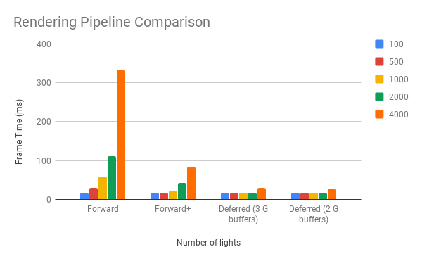

WebGL Clustered and Forward+ Shading
======================

**University of Pennsylvania, CIS 565: GPU Programming and Architecture, Project 5**

* Alexander Chan
* Tested on: **Google Chrome 70.0** on
  Windows 10 Version 1803, i7-5820k @ 3.70 GHz 16GB, GTX 1080 @ 1620 MHz 8GB (Personal Computer)

### Live Online

### Demo Video/GIF

1000 lights with deferred clustered shading at 60 fps.

### Analysis

| Number of lights | Forward     | Forward+    | Deferred (3 G buffers) | Deferred (2 G buffers) |
|------------------|-------------|-------------|------------------------|------------------------|
| 100              | 16.66666667 | 16.66666667 | 16.66666667            | 16.66666667            |
| 500              | 29.41176471 | 16.66666667 | 16.66666667            | 16.66666667            |
| 1000             | 58.82352941 | 23.25581395 | 16.66666667            | 16.66666667            |
| 2000             | 111.1111111 | 41.66666667 | 16.66666667            | 16.66666667            |
| 4000             | 333.3333333 | 83.33333333 | 29.41176471            | 28.57142857            |

At 100 lights, I was able to hit the FPS cap for all the different pipelines (even forward rendering). However, increasing the number of lights to 500 revealed that the vanilla forward pipeline had much worse performance, as the frametime almost doubled, while there was no change for the other 3 tested.

As the number of lights increased, the deferred pipelines stayed at the FPS cap, while the forward+ pipeline started to fall at 1000 lights. This is interesting as the logic behind the deferred and forward+ fragment shaders is exactly the same. The performance increase is likely due to the fact that the fragment shader itself is quite expensive (as we iterate over the number of lights in this cluster, which can be very high), and the deferred pipeline guarantees that this expensive shader is run only once per pixel. The forward+ pipeline may be running the fragment shader on fragments that are not drawn to the screen.

The optimized deferred pipeline only uses 2 gbuffers instead of 3, encoding a 3 component normal in 2, and reconstructing it in the fragment shader. Another compression technique would be to store only the depth in the gbuffer, instead of the position, and reconstruct the world space position in the fragment shader.

There is a slight improvement, but not that noticeable (only 1 fewer ms per frame). However, when doing more complex shading, such as PBR shading with more fragment attributes (such as metallic, specular, roughness, velocity for motion blur, etc) it may have a much larger improvement packing all of the attributes into the smallest amount of data possible. This simple shading with a color and a normal does not benefit as much.

### Credits

* [Three.js](https://github.com/mrdoob/three.js) by [@mrdoob](https://github.com/mrdoob) and contributors
* [stats.js](https://github.com/mrdoob/stats.js) by [@mrdoob](https://github.com/mrdoob) and contributors
* [webgl-debug](https://github.com/KhronosGroup/WebGLDeveloperTools) by Khronos Group Inc.
* [glMatrix](https://github.com/toji/gl-matrix) by [@toji](https://github.com/toji) and contributors
* [minimal-gltf-loader](https://github.com/shrekshao/minimal-gltf-loader) by [@shrekshao](https://github.com/shrekshao)
