WebGL Clustered and Forward+ Shading
======================

**University of Pennsylvania, CIS 565: GPU Programming and Architecture, Project 5**

* Xinyu Lin
[Linkedin](https://www.linkedin.com/in/xinyu-lin-138352125/)
* Tested on: Google Chrome 69.0.3497.199, macOS(Version 10.13.6), Intel Core i7 2.9 GHz, 16GB, Radeon Pro 560 4096MB (Private Computer)

### Live Online

[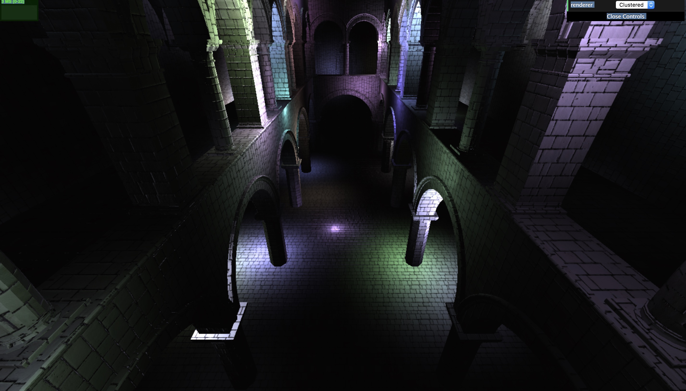](https://460xlin.github.io/Project5-WebGL-Clustered-Deferred-Forward-Plus/)

### Demo Video/GIF

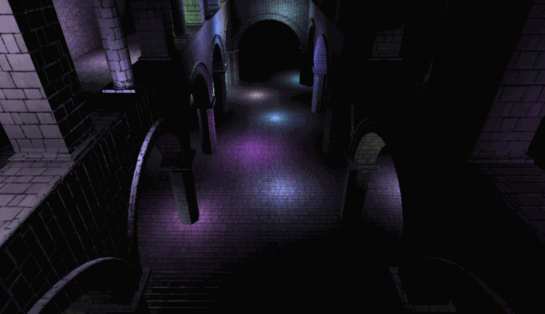

### Cel Shading

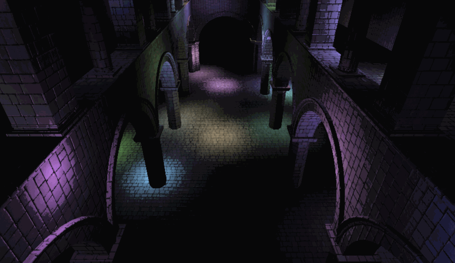

### Blinn-phong

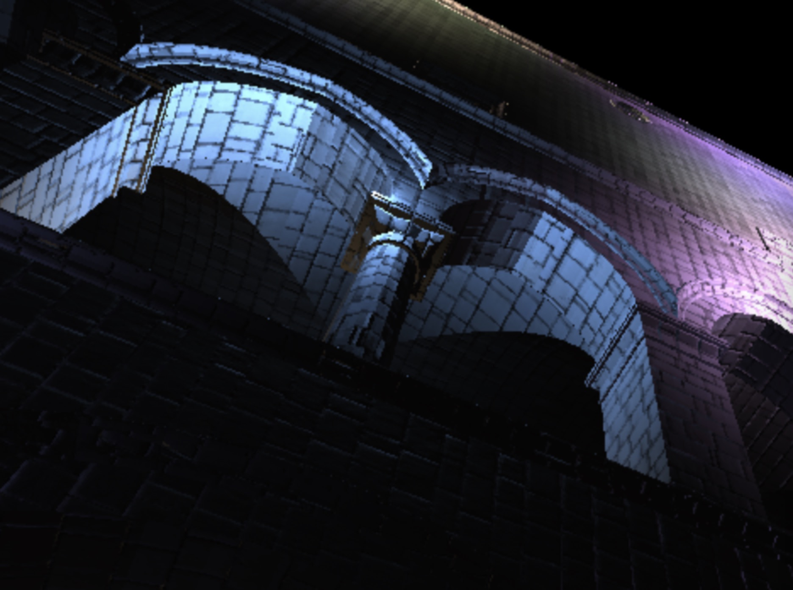

### Features

- Cluster update
  - Devide the whole frustum into **_xSclices * _ySlices * _zSlices** clusters and assign lights into overlapping clusters
- Foward+
  - Build a data structure (texture buffer) to keep track of how many lights are in each cluster with their indices
  - Render the scene using only the lights that overlap a given cluster
- Clustered
  - Reuse clustering logic
  - Store vertex attributes in g-buffer
  - Read g-buffer and render scene to produce final output
- Effect
  - Blinn-Phong shading
  - Cel shading
- Optimization
  - Pack values into vec4, reduce number of g-buffers from 4 to 3, reconstructing world position using camera matrice and (gl.FragCoord.x, gl.FragCoord.y, depth)

### Analysis

Albedo | Normal
:--:|:--:
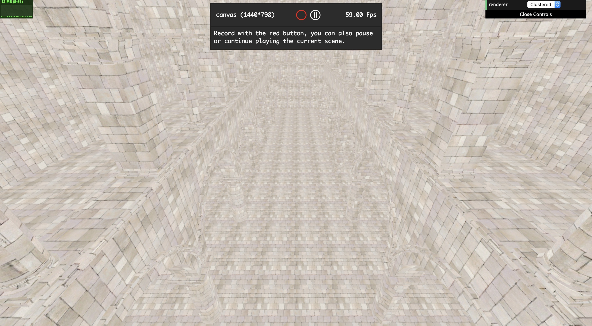 | 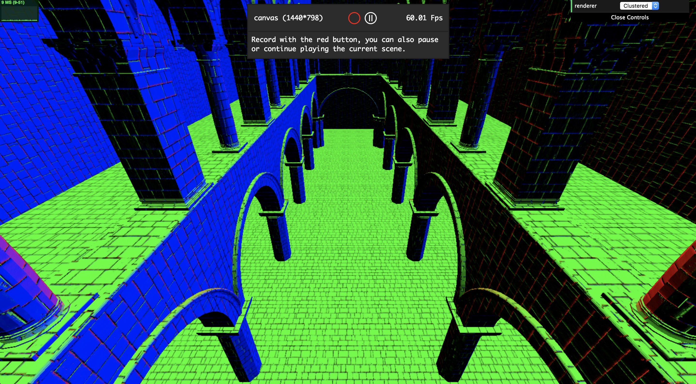
World Position
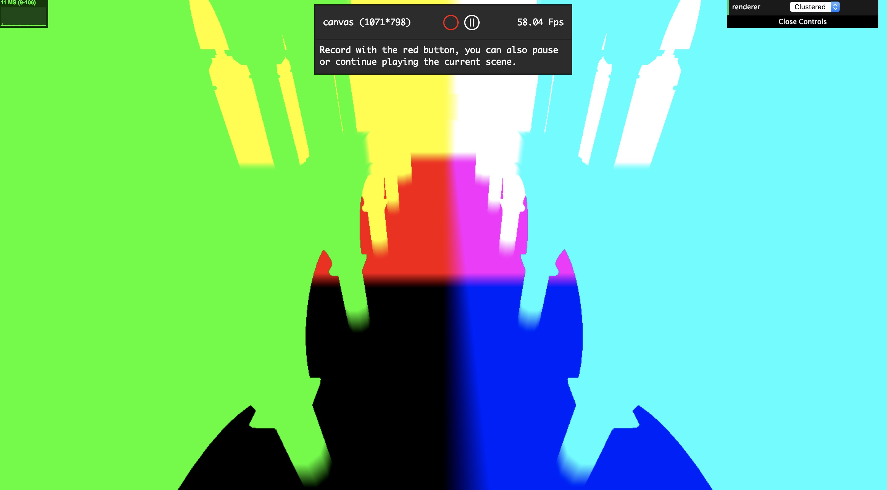

* Clusterd
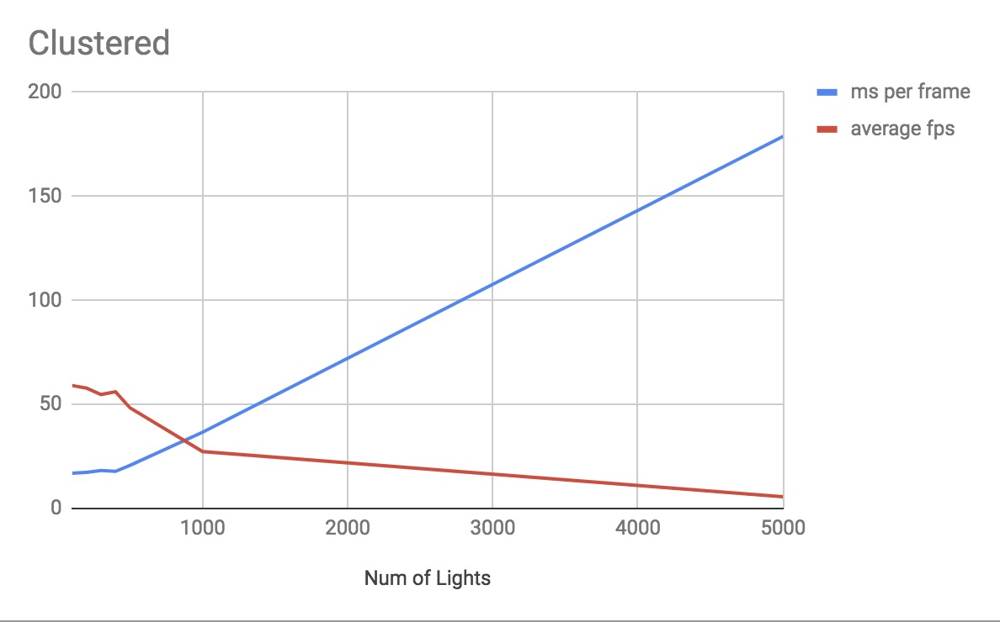

* Forward
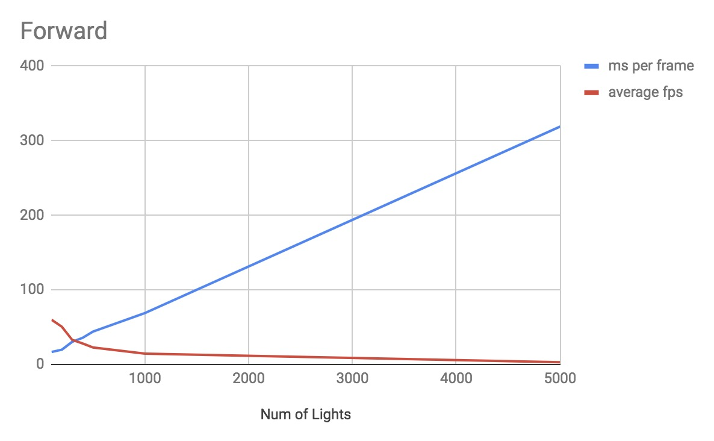

* Forward+
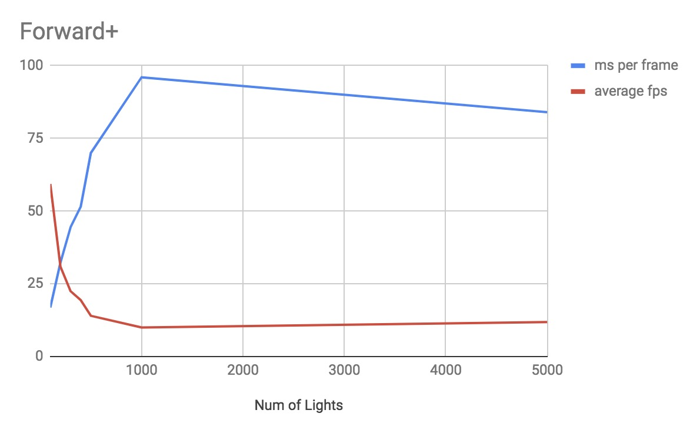

##### Performance comparison of Forward, Foward+ and Clustered methods
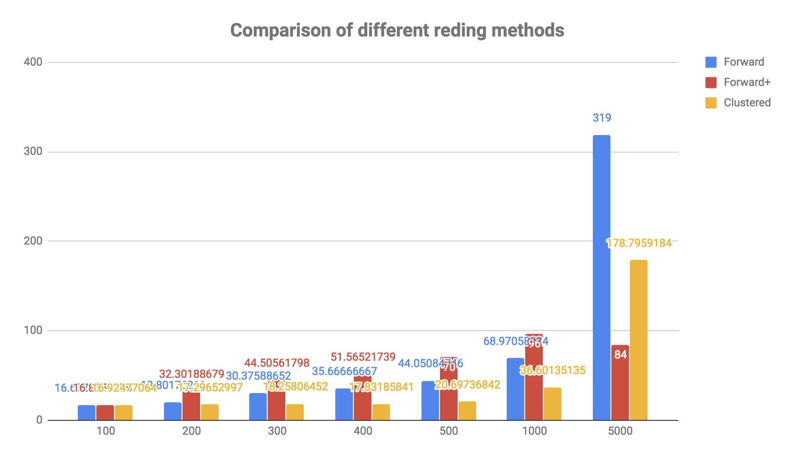

From the comparison of different rendering methods' performances, we can find that as the number of lights increases, the performance of Forward rendering dramatically drops. Also, the performance of Forward rendering is worse than Forward Plus and Clustered Deferred rendering. Also, Forward Plus Rendering is better than Clustered Rendering. 
### Credits

* [Three.js](https://github.com/mrdoob/three.js) by [@mrdoob](https://github.com/mrdoob) and contributors
* [stats.js](https://github.com/mrdoob/stats.js) by [@mrdoob](https://github.com/mrdoob) and contributors
* [webgl-debug](https://github.com/KhronosGroup/WebGLDeveloperTools) by Khronos Group Inc.
* [glMatrix](https://github.com/toji/gl-matrix) by [@toji](https://github.com/toji) and contributors
* [minimal-gltf-loader](https://github.com/shrekshao/minimal-gltf-loader) by [@shrekshao](https://github.com/shrekshao)
