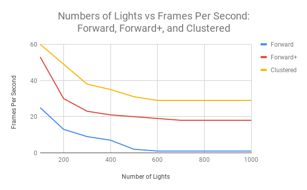
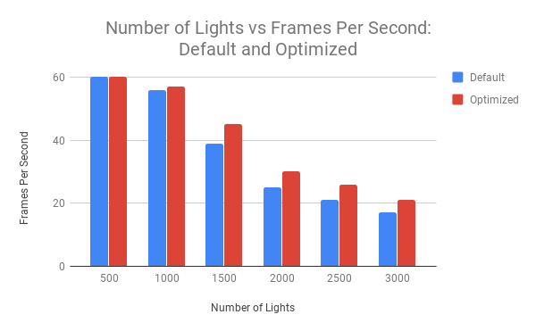

WebGL Clustered and Forward+ Shading
======================

**University of Pennsylvania, CIS 565: GPU Programming and Architecture, Project 5**

* Eric Chiu
* Tested on: Macbook Pro (Retina, 15-inch, Mid 2015), OS X El Capitan 10.11.6, 2.5 GHz Intel Core i7, AMD Radeon R9 M370X 2048 MB

## Live Online

## Description

This project implements 

## Performance Analysis

## Forward Plus

## Clustered Lambert Shading

## Clustered Phong Shading

## Clustered Toon Shading

## Clustered Iridescent Shading

## Clustered Sobel Shading

### Credits

* [Three.js](https://github.com/mrdoob/three.js) by [@mrdoob](https://github.com/mrdoob) and contributors
* [stats.js](https://github.com/mrdoob/stats.js) by [@mrdoob](https://github.com/mrdoob) and contributors
* [webgl-debug](https://github.com/KhronosGroup/WebGLDeveloperTools) by Khronos Group Inc.
* [glMatrix](https://github.com/toji/gl-matrix) by [@toji](https://github.com/toji) and contributors
* [minimal-gltf-loader](https://github.com/shrekshao/minimal-gltf-loader) by [@shrekshao](https://github.com/shrekshao)
