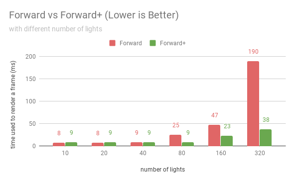

WebGL Clustered and Forward+ Shading
======================

**University of Pennsylvania, CIS 565: GPU Programming and Architecture, Project 5**

* Zichuan Yu
  * [LinkedIn](https://www.linkedin.com/in/zichuan-yu/), [Behance](https://www.behance.net/zainyu717ebcc)
* Tested on: **Google Chrome 70.0.3538.77 (Official Build) (64-bit)** MacBook Pro (Retina, 15-inch, Mid 2015), 2.5 GHz Intel Core i7 16 GB 1600 MHz DDR3, AMD Radeon R9 M370X 2048 MB / Intel Iris Pro 1536 MB

### Demo GIF

### Performance Analysis

### Credits

* [Three.js](https://github.com/mrdoob/three.js) by [@mrdoob](https://github.com/mrdoob) and contributors
* [stats.js](https://github.com/mrdoob/stats.js) by [@mrdoob](https://github.com/mrdoob) and contributors
* [webgl-debug](https://github.com/KhronosGroup/WebGLDeveloperTools) by Khronos Group Inc.
* [glMatrix](https://github.com/toji/gl-matrix) by [@toji](https://github.com/toji) and contributors
* [minimal-gltf-loader](https://github.com/shrekshao/minimal-gltf-loader) by [@shrekshao](https://github.com/shrekshao)
