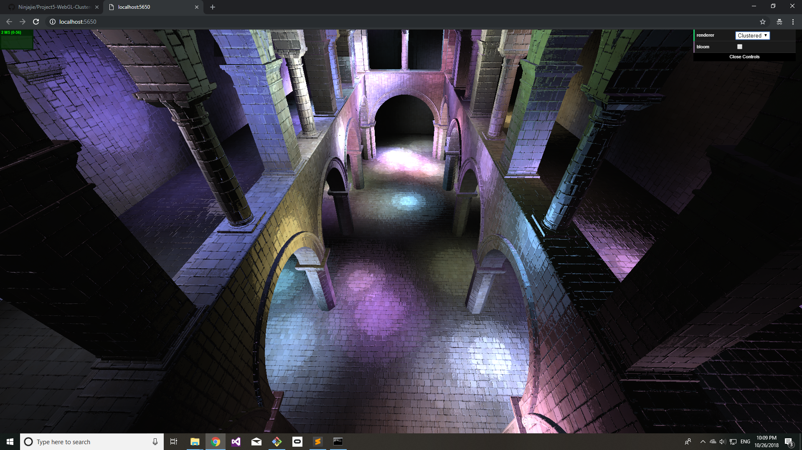
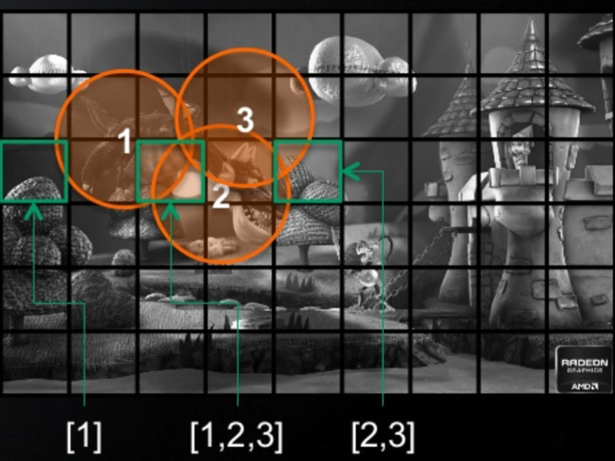
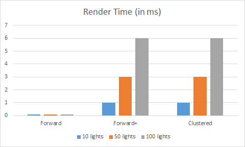
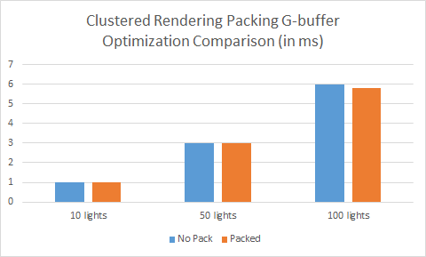

WebGL Clustered and Forward+ Shading
======================

**University of Pennsylvania, CIS 565: GPU Programming and Architecture, Project 5**

* Liam Dugan -- Fall 2018
  * [LinkedIn](https://www.linkedin.com/in/liam-dugan-95a961135/), [personal website](http://liamdugan.com/)
* Tested on: **Google Chrome 71.0** Windows 10, Intel(R) Xeon(R) CPU E5-2687W v3 @ 3.10GHz 32GB, TITAN V 28.4GB (Lab Computer)

### Live Online

### Demo Video/GIF

What are Forward+ and Clustered Rendering?
=============

Forward+ and Clustered are special rendering techniques used to optimize lighting calculations in scenes with many moving light sources.

Usually, the way light calculations are handled is to loop over all lights in the scene for each fragment 
(i.e. pixel) and calculate the effect each and every light has on the pixel for every frame.
This is clearly not the most efficient way, since there will be many distant lights with little to no effect
on the pixel taking up valuable processing time.

**Forward+ Rendering** (Or sometimes called **Tiled Rendering**), splits the screen up into individual tiles and keeps track of a 
data structure that denotes which lights are within which tiles. 

This data structure is then passed to the GPU so that each pixel only must loop over the lights in their specific
cluster and not all lights in the scene.

**Deferred Clustered Rendering** takes this one step further and involves the depth of each fragment as well to further 
cull unnecessary light sources. In addition, in order to avoid having to compute the fragment transforms multiple times, the rendering is broken up into two stages. The first stage computes the vertex transforms and stores all of the 
data into a G-buffer, then the second stage uses that information and the cluster data structure to compute the lighting.

Performance Analysis
================

As we can see from the graph below, the performance data shows that for our small scene, the simpler algorithm is best
even at a somewhat large number of lights. This may also be due to the power and memory capability of the GPU that I tested on.
I tested on a TITAN V, which has plenty of computation capability and so the lack of memory reads that the 
Foward rendering technique had probably gave it a very large advantage over the very read/write heavy Forward+ and Clustered.

To help combat this bottleneck I implemented a packing optimization to reduce the total number of G-buffer 
spaces used, but it only had a very minor effect towards the end.

One of the other main reasons why I suspect that my code is running slow is the lack of precision when 
checking sphere frustum intersections. I check if the center of the light is within frustum orthocenter to corner + light radius units 
of the frustum center, which is simply an approximation of the actual intersection algorithm (which involves checking for 6 planes).

Since the GPU is much better at handling computational work than memory reads and since the lack of precision likely amounted to 
a larger cluster to light data structure, this would slow the algorithm down a lot since it has to read and write more data. 

I suspect that if I were to have implemented this optimization then we would see the Clustered rendering perform well on very closed but long scenes  with many light sources and
we would see the forward+ rendering work well for the more open and far away scenes with many light sources. (Forward would of course do better on scenes with fewer lights).

### Credits

* [Three.js](https://github.com/mrdoob/three.js) by [@mrdoob](https://github.com/mrdoob) and contributors
* [stats.js](https://github.com/mrdoob/stats.js) by [@mrdoob](https://github.com/mrdoob) and contributors
* [webgl-debug](https://github.com/KhronosGroup/WebGLDeveloperTools) by Khronos Group Inc.
* [glMatrix](https://github.com/toji/gl-matrix) by [@toji](https://github.com/toji) and contributors
* [minimal-gltf-loader](https://github.com/shrekshao/minimal-gltf-loader) by [@shrekshao](https://github.com/shrekshao)
