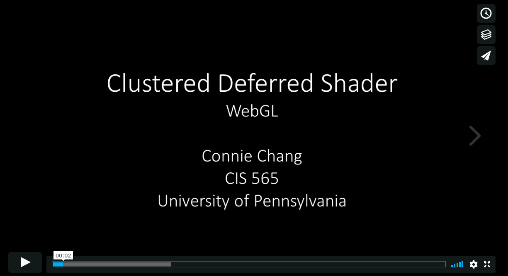
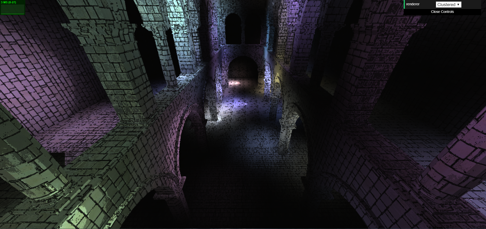
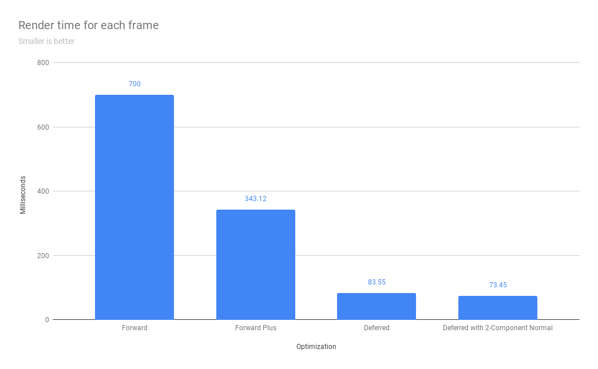

WebGL Clustered and Forward+ Shading
======================

**University of Pennsylvania, CIS 565: GPU Programming and Architecture, Project 5**

* Connie Chang
  * [LinkedIn](https://www.linkedin.com/in/conniechang44), [Demo Reel](https://www.vimeo.com/ConChang/DemoReel)
* Tested on: **Google Chrome 70.0** on
  Windows 8, i7-4510U @ 2.00GHz 8GB, Intel HD Graphics 4400 128MB (Personal laptop)

### Live Online

[Live Demo](https://cawney4.github.io/Project5-WebGL-Clustered-Deferred-Forward-Plus/)

### Demo Video/GIF

### Introduction
This was a quick project in WebGL to implement forward plus and deferred shading algorithms. A comparison among forward plus, deferred, and plain forward can be found at the bottom of the page. In addition, the deferred forward plus has toon shading and 2-component normals for G-buffer optimization.  

### Features
* Forward Plus
* Deferred Forward Plus
* 2-Component Normal Optimization
* Toon shading (Ramp shading and Sobel edge detection)

### Toon Shading
  

For toon shading, I implemented ramp shading and edge detection with a Sobel filter. The ramp shading simply discretizes the Lambertian term in the lighting calculations. Sobel applies a kernel to a pixel's neighbors to see if it's at an edge. If it is, I make that pixel darker. The effect looks a little gross, with the dark edges looking like mold. But it does feel a bit cartoon-y.  

### Performance
All render times were recorded with 100 lights in the scene, using the Chrome DevTools Profiler. The times are in milliseconds and per frame. The tile grid was 15 x 15 x 15.

The chart shows that each optimization algorithm improved performance. Forward Plus was a huge gain compared to Forward, cutting render times by half. Deferred then cut it down by another factor of 4. Finally, 2-component normals showed a sliver of improvement, but it was not as drastic.  

The improvement between Forward Plus and Forward makes sense because we no longer have to check every light for every fragment. Rather, only the lights in the same tile are checked. Since the lights are so spread out, this proves to be useful because the lights are placed into different tiles. On the other hand, if our scene had lights all gathered in a single tile, this optimization would not be useful.  

Deferred shading improved performance because it only computes lighting for a single fragment per pixel. Before, every fragment along the depth of a pixel would compute lighting information and store it. Instead of doing that for this optimization, we store which fragment has the closest depth. Once we have determined which fragment is closest, we only compute lighting for that one. In a scene with numerous lights, this is useful because calculating light contribution from every light source can be expensive. With deferred shading, we only need to do this once, saving a ton of time.  

Storing 2-component normals in the G-buffer did not exhibit a big improvement. This makes sense because we need to do extra computation to calculate the third component of the normal. However, we still save some time by reading one less texture.  

### Credits

* Jie Meng, Zach Corse, Ishan Ranade, Aman Sachan
* [Three.js](https://github.com/mrdoob/three.js) by [@mrdoob](https://github.com/mrdoob) and contributors
* [stats.js](https://github.com/mrdoob/stats.js) by [@mrdoob](https://github.com/mrdoob) and contributors
* [webgl-debug](https://github.com/KhronosGroup/WebGLDeveloperTools) by Khronos Group Inc.
* [glMatrix](https://github.com/toji/gl-matrix) by [@toji](https://github.com/toji) and contributors
* [minimal-gltf-loader](https://github.com/shrekshao/minimal-gltf-loader) by [@shrekshao](https://github.com/shrekshao)
