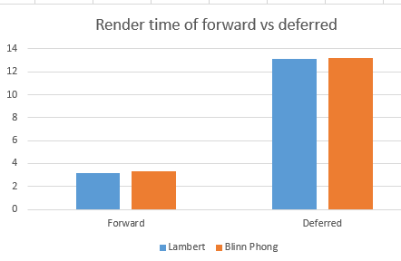
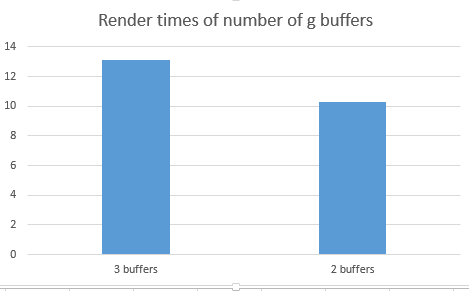
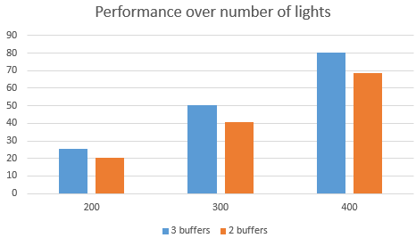

WebGL Clustered and Forward+ Shading
======================

**University of Pennsylvania, CIS 565: GPU Programming and Architecture, Project 5**

* Henry Zhu
* [Github](https://github.com/Maknee), [LinkedIn](https://www.linkedin.com/in/henry-zhu-347233121/), [personal website](https://maknee.github.io/), [twitter](https://twitter.com/maknees1), etc.
* Tested on: Windows 10 Home, Intel i7-4710HQ @ 2.50GHz 22GB, GTX 870M (Own computer)

### Live Online

### Demo Video/GIF

#### Forward

#### Deferred

## Features

### Blinn Phong

Blinn phong is a technique used to simulate light realistically. This did not impact performance much as it only required a bit more calculation than lambert shading. 

The chart shows no almost impact in performance (measured in milliseconds).

Optimizations might not be possible as this blinn phong is just a calcuation

This can be enabled by commenting/uncommenting the code in the glsl code.

### Optimized g-buffer format

I optimized the g buffer format by packing the normals, coloir and position into two buffers. This is done by using 2 component normals.

One can infer the third position of the normal by subtracting the square root of the other normal positions from one.

This resulted in a somewhat faster render time as there was less to unpack.

The best case scenario for performance improvement is probably to pack even less information. If the lights were of one color, there would not be a need for packing the color.

There is a trade off. The memory usage is less, but the work done increases. 

This is due to the caculation of the last normal from the x and y components of the normal.

The number of lights/ tile size affects performance by having much less memory to use for the g buffer.

As the number of lights increases, the performance gain from the two buffers inceases.

### Credits

Slides on deferred shading from 565
* [https://docs.google.com/presentation/d/1W-Gp9mWvZ8DlppiNFJu_RngFVB34r9CXq4BhQEPbJYM/edit#slide=id.p32](https://docs.google.com/presentation/d/1W-Gp9mWvZ8DlppiNFJu_RngFVB34r9CXq4BhQEPbJYM/edit#slide=id.p32)

Slide links on deferred/forward shading:
* [http://marcinignac.com/blog/deferred-rendering-explained/](http://marcinignac.com/blog/deferred-rendering-explained/)
* [https://www.leadwerks.com/files/Deferred_Rendering_in_Leadwerks_Engine.pdf](https://www.leadwerks.com/files/Deferred_Rendering_in_Leadwerks_Engine.pdf)
* [http://www.floored.com/blog/2015webgl-deferred-shading-gbuffer-floating-point-texture/](http://www.floored.com/blog/2015webgl-deferred-shading-gbuffer-floating-point-texture/)

* [Three.js](https://github.com/mrdoob/three.js) by [@mrdoob](https://github.com/mrdoob) and contributors
* [stats.js](https://github.com/mrdoob/stats.js) by [@mrdoob](https://github.com/mrdoob) and contributors
* [webgl-debug](https://github.com/KhronosGroup/WebGLDeveloperTools) by Khronos Group Inc.
* [glMatrix](https://github.com/toji/gl-matrix) by [@toji](https://github.com/toji) and contributors
* [minimal-gltf-loader](https://github.com/shrekshao/minimal-gltf-loader) by [@shrekshao](https://github.com/shrekshao)
