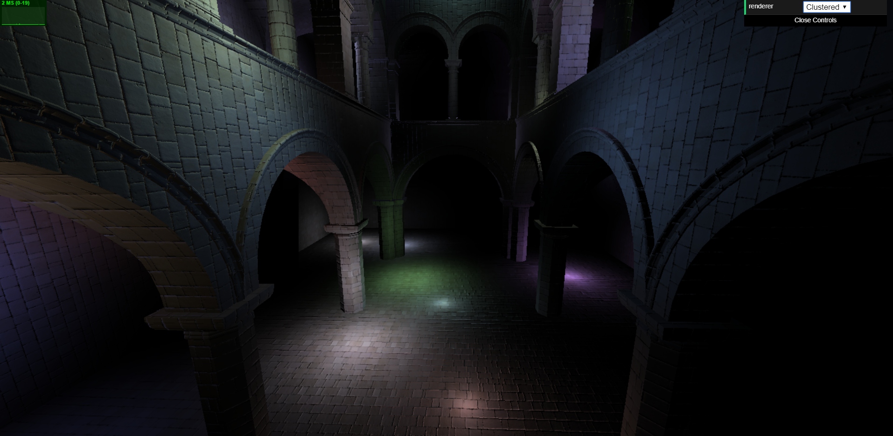
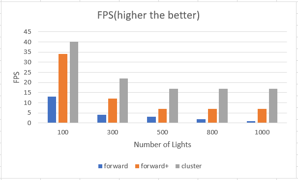

WebGL Clustered and Forward+ Shading
======================

**University of Pennsylvania, CIS 565: GPU Programming and Architecture, Project 5**

* Yan Wu
* Tested on: **Google Chrome 70.0** on
  Windows 10, i7-8750H @ 2.20GHz 16GB, GTX 1060 6GB (Personal Laptop)

### Live Online
* Still in development  

### Demo Video/GIF
* Click the picture for video! 

### Performance Analysis
* FPS analysis with three methods
  
   - We can see clearly that cluster method is better than the other two.
* In development...

### Credits

* [Three.js](https://github.com/mrdoob/three.js) by [@mrdoob](https://github.com/mrdoob) and contributors
* [stats.js](https://github.com/mrdoob/stats.js) by [@mrdoob](https://github.com/mrdoob) and contributors
* [webgl-debug](https://github.com/KhronosGroup/WebGLDeveloperTools) by Khronos Group Inc.
* [glMatrix](https://github.com/toji/gl-matrix) by [@toji](https://github.com/toji) and contributors
* [minimal-gltf-loader](https://github.com/shrekshao/minimal-gltf-loader) by [@shrekshao](https://github.com/shrekshao)
