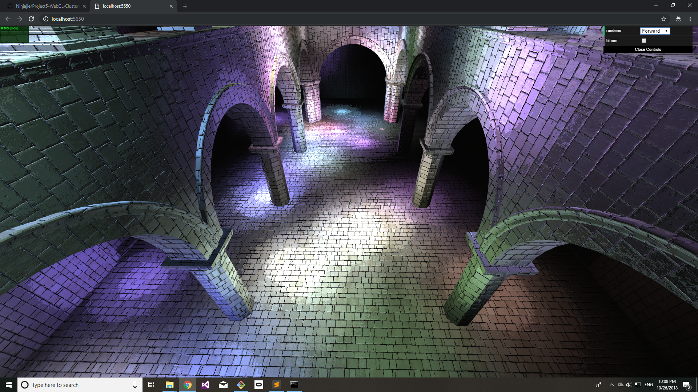
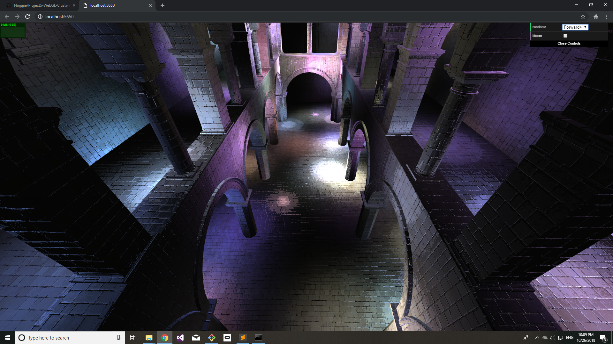
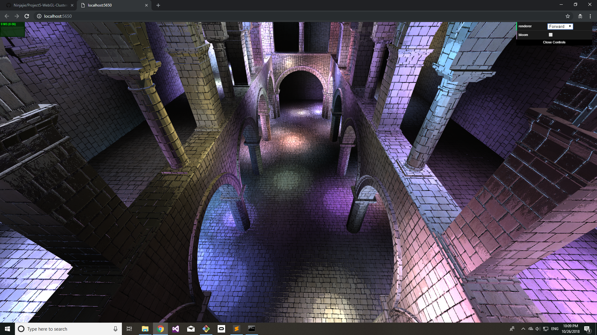
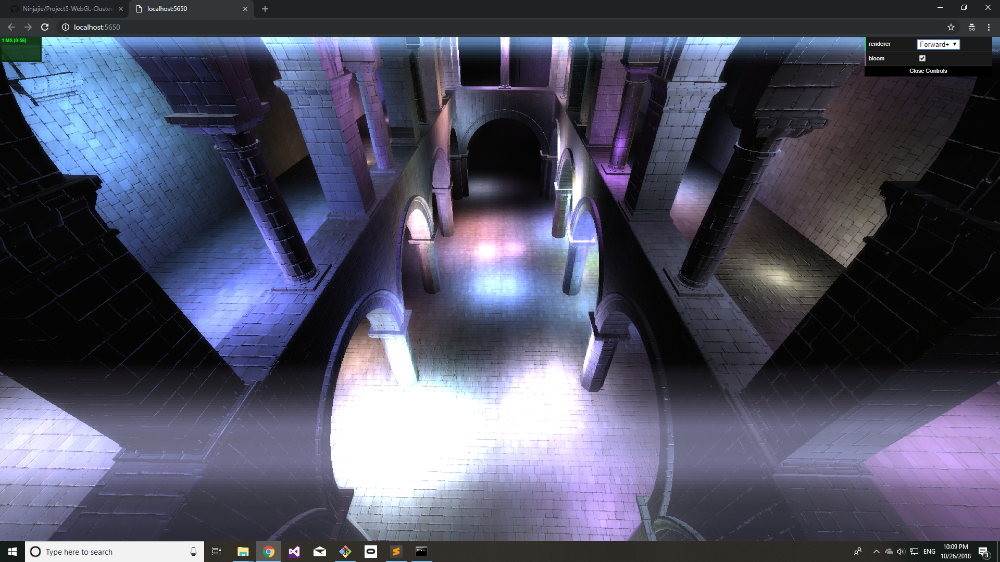
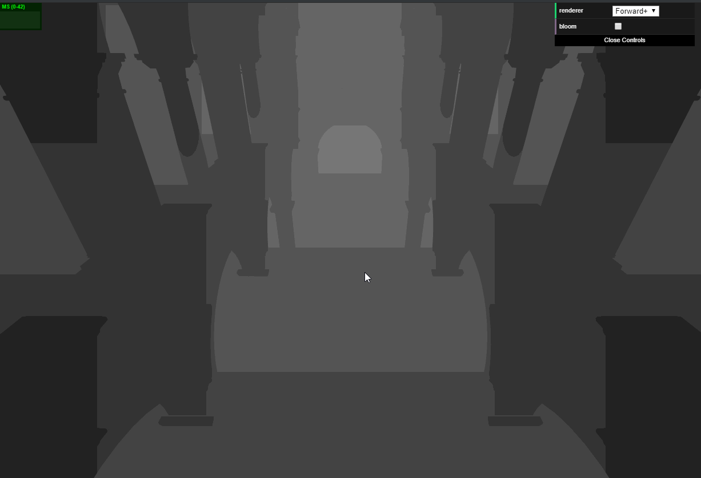
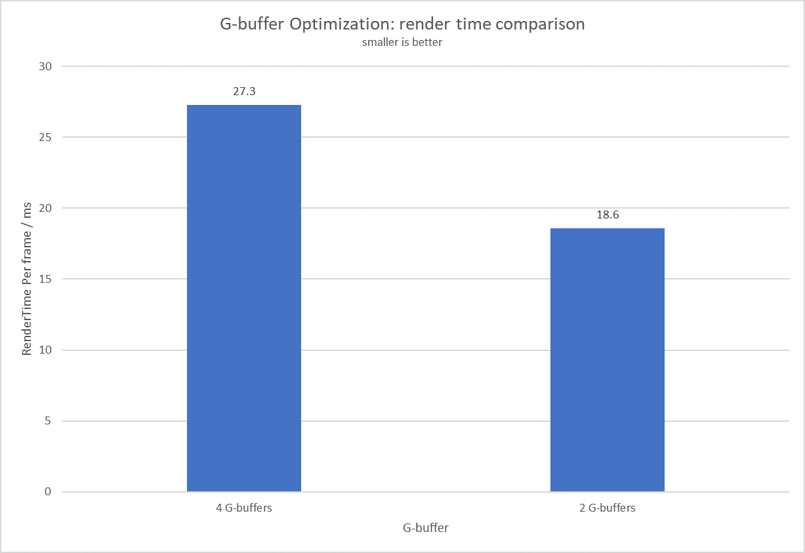
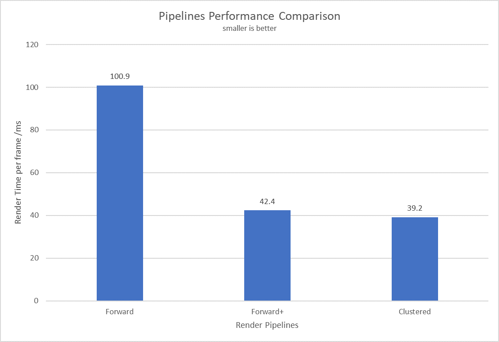
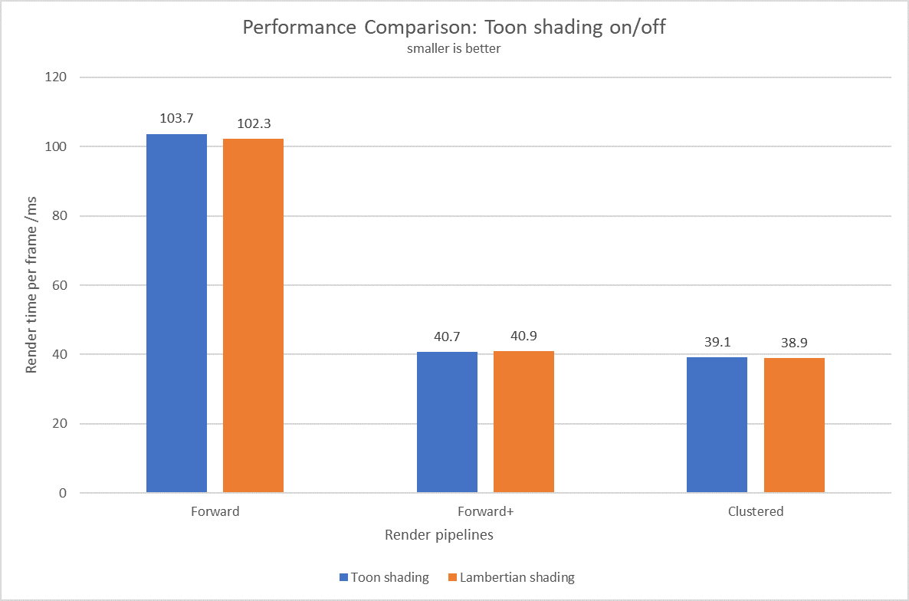

WebGL Clustered and Forward+ Shading
======================

**University of Pennsylvania, CIS 565: GPU Programming and Architecture, Project 5**

* Jie Meng
  * [LinkedIn](https://www.linkedin.com/in/jie-meng/), [YouTube](https://www.youtube.com/channel/UC7G8fUcQrrI_1YnXY5sQM6A).
* Tested on: Windows 10, i7-7700HQ @ 2.80GHz, 16GB, GTX 1050 4GB (Personal Laptop)

## Live Online

`npm run build` keep showing errors, will be fixed soon

## Demo Video

Project Doc
==================

## Heads up - screenshots

Configuration: all running with 300 moving lights, *Toon Shading*

  | 
--------------------------|----------------------------
Forward render|   Forward+ render

  | 
--------------------------|----------------------------
Forward render|   Cluster deferred render

  | 
--------------------------|----------------------------
Forward render|   Cluster deferred render

  | 
--------------------------|----------------------------
Forward+ w/o bloom|   Forward+ w/ bloom

## Pipelines

Cluster technique is used in both Forward+ and Deferred shading pipelines for this project:

### (Clustered) Forward+
 - divide view frustum into clusters, compute which light is in whcih cluster
 - in render stage, for each cluster only render the lights that influencing it

### (Clustered) Deferred
 - divide view frustum into clusters, compute which light is in whcih cluster
 - packing vertex attributes like color and normal into g-buffers
 - read g-buffers in fragment shader to perform shading stage

## Optimization

**Optimized G-buffer in Deferred shading**
 - Originally, 4 g-buffers are needed
 - After optimization, only 2 g-buffers are needed:
 - g-buffer1:  RGB color & view space depth
 - g-buffer2:  normal & NDC_Depth
 - all other values can be reconstructed from these g-buffer values

## Effects
 - Toon shading

 
 - Bloom (buggy, currently screen has flash, but **kinda cool, isn't it?**) implemented by adding extra stages into pipeline: brightness fitler, gaussian blur and combine shader (same as bloom stages in [CUDA-Rasterizer](https://github.com/Ninjajie/Project4-CUDA-Rasterizer))

Analysis
=====================

*Configuration: 1080p canvas, 300 lights sponza scene*

## g-buffer optimization performances

Naive implementation requires 4 g-buffers:

|g-buffer index| Content |
|------------|------------|
|0 | albedo (RGB)|
|1 | normal (XYZ)|
|2 | depth (float)|
|3 | position (XYZ)|

The buffers are visualized as follows:

#### Albedo

-------------------

#### Normal

-------------------

#### Depth

-------------------

The optimization is aimed at storing only the very necessary data, and other data can be reconstructed from them.
After optimization, only two g-buffers are needed, they are organized like this:
|g-buffer index| Content xyz| Content w|
|--------------|------------|----------|
|      0       | albedo (RGB) | View Space Depth|
|      1       | normal (XYZ) | Screen Space Depth|

#### Performance Comparison:

Render time per frame noticably decrease with g-buffer optimization. The main reason
for this is that the bandwidth is saved when only 2 g-buffers are used.

## Different Pipelines Performance Comparison

 - Forward pipeline is naive: check every light against each fragment in shading stage
 - (Clustered) Forward+ pipeline is a smarter pipeline, with clustered frustrum, only check cluster with influencing lights, but limited by bandwidth
 - (Clustered) Deferred pipeline is another pipeline using clusters, by optimizing g-buffer, it reduces the burden on bandwith
 - Frustum divide is done by slicing z-direction in logarithmic way, and x-y-directions in linear way

As shown in the chart, clustered pipelines outperform naive forward renderer. Moreover, clustered deferred shading is slightly better than forward+ in this configuration.

## Effects performances

Bloom effect is currently buggy, so performance analysis is skipped.

For toon shading, it's just normal Lambertian shading been discretized, so it shouldn't have impact on the performance:

The experiment results confirm our assumption.

### Credits

* [Three.js](https://github.com/mrdoob/three.js) by [@mrdoob](https://github.com/mrdoob) and contributors
* [stats.js](https://github.com/mrdoob/stats.js) by [@mrdoob](https://github.com/mrdoob) and contributors
* [webgl-debug](https://github.com/KhronosGroup/WebGLDeveloperTools) by Khronos Group Inc.
* [glMatrix](https://github.com/toji/gl-matrix) by [@toji](https://github.com/toji) and contributors
* [minimal-gltf-loader](https://github.com/shrekshao/minimal-gltf-loader) by [@shrekshao](https://github.com/shrekshao)
