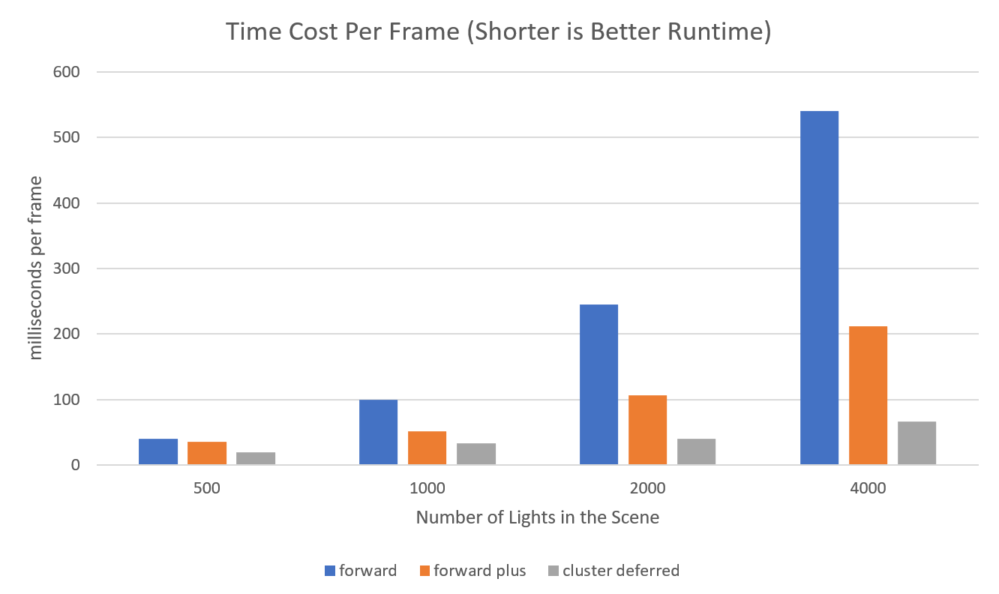
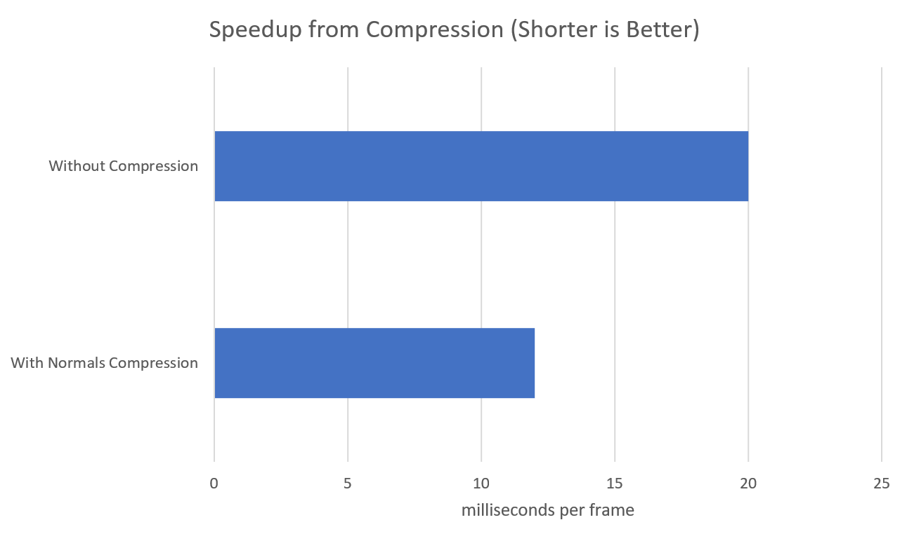
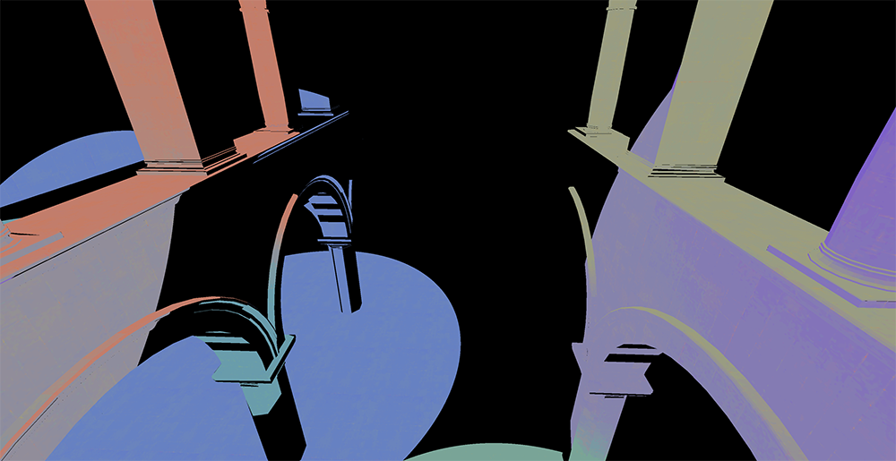
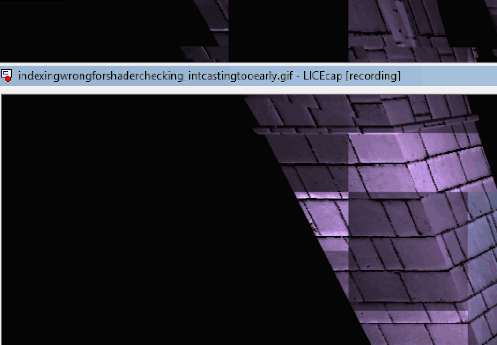
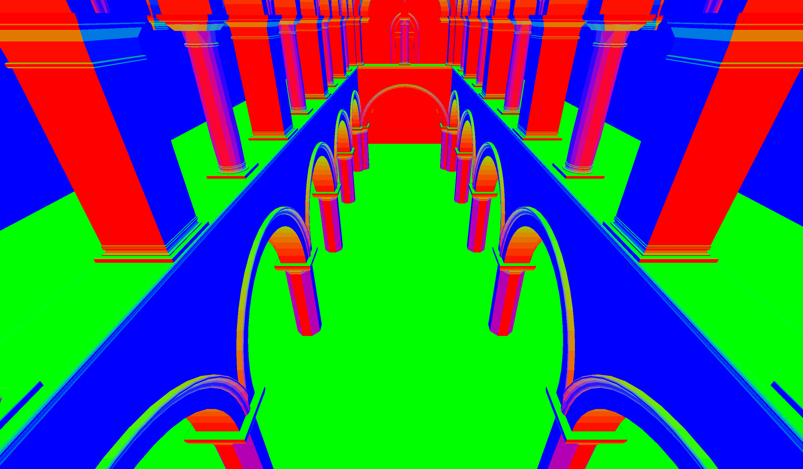

WebGL Clustered and Forward+ Shading
======================

**University of Pennsylvania, CIS 565: GPU Programming and Architecture, Project 5**

Hannah Bollar: [LinkedIn](https://www.linkedin.com/in/hannah-bollar/), [Website](http://hannahbollar.com/)
 
Tested on: Chrome, Windows 10 Pro, i7-8550U @ 1.80GHz 15.9GB (Personal)
____________________________________________________________________________________

   

[//]: # ( !


[Live Online](#live-online) - [Features](#visuals) - [Shading Techniques](#shading-techniques) - [Effects and Optimizations](#effects-and-optimizations) - [Bloopers and Debugging](#bloopers-and-debugging) - [Credits](#credits) 

## Live Online


This didnt deploy properly so the live link doesnt work (tbd).

## Features

 - Forward
 	- already implemented as a demo for the assignment
 - Forward+
	- Build a data structure to keep track of how many lights are in each cluster and what their indices are
	- Render the scene using only the lights that overlap a given cluster
 - Clustered
	- Reuse clustering logic from Forward+
	- Store vertex attributes in g-buffer
	- Read g-buffer in a shader to produce final output
 - Effects
	- deferred Blinn-Phong shading (diffuse + specular) for point lights
 
## Shading Techniques
Note: in the below gifs, LICECap software creates the blocky effect, the live version is much smoother.

### Forward Rendering

This was already implemented as a demo for how the assignment was constructed, and this version of shading is the most straight forward. The overhead of this is that an excessive number of lights will very quickly slow down this simulation.
```
for each geometry {
  for each light {
    do calculations...
  }
}
```

### Forward Plus

`*` GIF CONVERTER MADE THIS CHOPPY and have dots (will update in a few days when can get to right computer but not in time for submission)

This video is of a forward plus implementation with a Blinn-Phong shader.

Instead of doing a double for loop over all the lights, this idea takes the looping and shortens the number of lights associated with each geometry based on the geometry's distance to the light. This improves the performance slightly to prevent the overhead of doing all the light checking for every single geometry.

```
prepass to find light distances
for each geometry {
  for each light that's appropriately near this geometry {
    do some calculations...
  }
}
```

### Clustered Deferred

`*` GIF CONVERTER MADE THIS CHOPPY and have dots (will update in a few days when can get to right computer but not in time for submission)

This video is of a clustered deferred implementation with a lambert shader.

Instead of doing the double `for loop` as in the previous two explanations, we create a mid geometry buffer which has a 2d texture storing geometry displacements as needed for rendering (`normal`s, `depth`, `albedo`, etc). This makes rendering even more optimized because it no longer requares the double for loop, but instead just requires a texture call.

```
for each light {
  prepass to fill in texture will all needed information
}

for each geometry {
  look up information in g-buffer as needed
  do some calculations with this information...
}
```

Something is currently wrong in this implementation :( . My assumption is that my light indexing isnt occuring on a gradient as it should, but is being additive without taking into consideration distances (giving the solid circle effect).

## Effects and Optimizations

### Lambert and Blinn-Phong Shading

Lambert | Blinn-Phong
:-------------------------:|:-------------------------:
| 


Currently, I have regular lambert shading and Blinn-Phong shading which adds a highlight to the scene. Comparing the two, Blinn-Phong has much stronger highlights as noted in the below images. Notice the flatness of the purple pillar's coloring in the Lambert compared to the more accentuated color changes in the Blinn-Phong.

### Optimizations

I packed information into the buffers in `vec4`s instead of just a listing of `float`s. Additionally, I optimized the space usage from three `vec4`s for positions, colors, and normals, to two `vec4`s by just abstracting out the `z` component of the normal to be recomputed later.

That is, I only put two `vec4`s into my buffer: `vec4(position.x, position.y, position.z, normal.x)` and `vec4(red, blue, green, normal.y)` and I recalculated `normal.z` by using `sqrt(1 - normal.x * normal.x - normal.y * normal.y)`. This optimization works because (hence the name) a normal is always normalized, so we can use the cross of their two attributes we do know to solve for the third.

### Runtime Comparisons



For shading techniques - it follows properly that as the number of lights increases, the runtime of all of the shading implementations goes up; however, the cluster deferred implementation still maintains the fastest runtime due to the texture call instead of recalculations (as explained in the  section). It also goes to show how much each of the techniques improves upon the one prior and that for real-time rendering deferred shading is an optimal solution.



For optimizations - Again, shorter is better. As the graph shows, the `z` optimization effectively makes for fewer pieces of memory being passed through the g-buffer, leading to a faster runtime.

## Bloopers and Debugging

### Bloopers

Clustered Deferred | Indexing-Resolution Issue
:-------------------------:|:-------------------------:
| 

- [no image]: for a long period of time I had my input values in my deferred shader swapped without realizing, so my output of `albedo` would skew up my lighting calculations since they were using the `albedo` as the `normal` and the `normal` as the `albedo`
- clustered deferred: as mentioned before, I still have this issue and my current understanding is that it's because of an indexing issue and/or a clamp issue when filling in the lights into the buffer in the first place. It's missing the gradient from the light's source to its radius but it does have the appropriate colors and locations. (unresolved)
- indexing-resolution issue: The indexing part of this error was that I was casting to an int for my indices before finishing certain calculations with them so I would get a squarish effect in the texture coordinates. The resolution part of this issue that led to LICECap's screen bar being captured in its own video was because worked on this project on a different machine than usual and the resolution was different than my screen capture's software settings. To fix this, I had to reconfigure the resolution specifically for capturing even though it made the text too small to read on the screen.

### Debug Visuals

Generic | Albedo | AbsNormals
:-------------------------:|:-------------------------:|:-------------------------:
|  | 

## Credits

* [Three.js](https://github.com/mrdoob/three.js) by [@mrdoob](https://github.com/mrdoob) and contributors
* [stats.js](https://github.com/mrdoob/stats.js) by [@mrdoob](https://github.com/mrdoob) and contributors
* [webgl-debug](https://github.com/KhronosGroup/WebGLDeveloperTools) by Khronos Group Inc.
* [glMatrix](https://github.com/toji/gl-matrix) by [@toji](https://github.com/toji) and contributors
* [minimal-gltf-loader](https://github.com/shrekshao/minimal-gltf-loader) by [@shrekshao](https://github.com/shrekshao)
