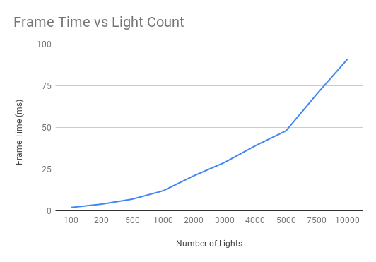

WebGL Clustered and Forward+ Shading
======================

* Salaar Kohari
* LinkedIn ([https://www.linkedin.com/in/salaarkohari](https://www.linkedin.com/in/salaarkohari))
* Website ([http://salaar.kohari.com](http://salaar.kohari.com))
* University of Pennsylvania, CIS 565: GPU Programming and Architecture
* Tested on: **Google Chrome** 10/25/2018 Windows 10, i7-8700K @ 3.7GHz 32GB, GTX 1060 6GB (Personal Computer)

### Description
In order to be able to render a scene with hundreds of thousands of lights, some GPU acceleration is required. Below, you will find details of techniques, visual results, and performance analysis.

In Forward+ rendering, the screen is divided into frustum clusters consisting of lights that influence the cluster region. These lights are mapped to a texture which can be read by the fragment shader to determine which lights to use to shade a given fragment. 

### Images

Forward+ rendering scene with 100 dynamic lights. On a desktop computer, this scene takes less than 3ms per frame to render.

This graph describes how performance is impacted by increasing numbers of lights. A major optimization food clustering was to only iterate over relevant clusters when adding lights to the scene. Additional performance, particularly at larger numbers of lights, could be obtained using a hierarchical data structure to store cluster light information.

Depth map shader. This viewing mode, along with other attribute shaders, is useful for debugging fragment shader information.

### Credits
* [Three.js](https://github.com/mrdoob/three.js) by [@mrdoob](https://github.com/mrdoob) and contributors
* [stats.js](https://github.com/mrdoob/stats.js) by [@mrdoob](https://github.com/mrdoob) and contributors
* [webgl-debug](https://github.com/KhronosGroup/WebGLDeveloperTools) by Khronos Group Inc.
* [glMatrix](https://github.com/toji/gl-matrix) by [@toji](https://github.com/toji) and contributors
* [minimal-gltf-loader](https://github.com/shrekshao/minimal-gltf-loader) by [@shrekshao](https://github.com/shrekshao)
