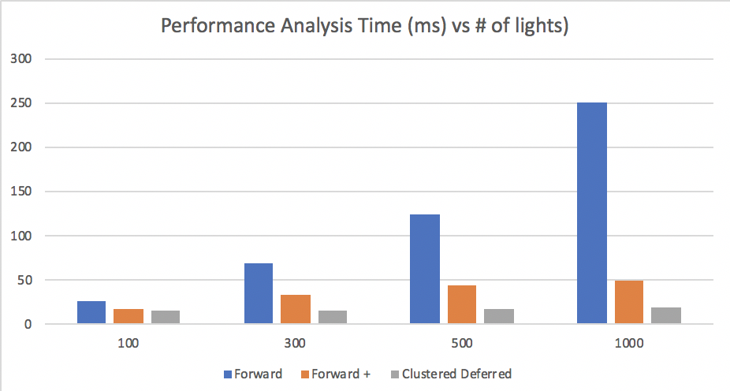

WebGL Clustered and Forward+ Shading
======================

**University of Pennsylvania, CIS 565: GPU Programming and Architecture, Project 5**

* Yu Sun 
* [LinkedIn](https://www.linkedin.com/in/yusun3/)
* Tested on: Tested on: Windows 10 , i7-6700HQ CPU @ 2.60GHz × 8 , GeForce GTX 960M/PCIe/SSE2, 7.7GB Memory (Personal Laptop)
## Introduction
In the previous project, a basic shading method was implemented. However, we notice that the implementation was not 
very efficient since we were doing multiple computation such as vertex transformation and rasterization many times for 
each object even if not all lights would affect a single project. Therefore, in this project, more efficient shading methods such as 
forward plus shading and clustered deferred shading is implemented and compared. 

```
* Clustered forward plus shading 
* clustered deferred shading with Blinn-Phong effect
* G-buffer usage optimization with 2-component normal
```

### Clusters
Both the forward plus shading and deferred shading take advantage of the concept of clusters. The idea is that
computing shading for each object with each light is too computation expensive. To save the amount of computation needed,
we divide the whole frame into grids, and define a radius of influence for the lights. Thus, we save the amount of 
computation by only computing lights that would have an influence on the object.

### Forward Shading and Deferred Shading
For forward shading, we are doing computation one step by one step, and ends up computing many times for objects that are actually 
occluded in the scene. This is not very efficient when there are a huge number of lights.

For deferred shading, we store the depth, normals, colors and other information we needed into a g-buffer, and do the 
shading for only objects that's visible in the scene. However, deferred shading does suffer from limitation of memory 
bandwidth since it reads from g-buffer for each light.

## Live Online

Wait to be added.
[](http://TODO.github.io/Project5B-WebGL-Deferred-Shading)

## Demo Video/GIF

 

## Analysis
The chart belows shows the amount of time taken to render each frame (averaged across 10 iterations) for the three shading 
methods introduced. 

It is clear that when the number of lights in the scene are small, all three methods don't have a significant difference 
in terms of performance. However, as the number of lights increase, the time required for the naive forward shading method 
increases significantly. While the clustered deferred shading keeps about the same performance. 

I also use 2-component normal to reduce the g-buffer size. Therefore, reducing the time that would require to read from
memory. However, I only have the implementation for two component g-buffer so I don't have the exact number of the amount 
of time it saves. However, rationally I would think the gain over time wouldn't be too significant. Since the g-buffer 
are stored in continuous memory, and when the program reads it can make use of cache as well. The significance however, 
lies in the amount of memory that we can save from this optimization. This is significant when we have huge amount of data
that we need to store. 

### Known Issue
The rendering using forward plus and clustered deferred led to some artifacts when the number of lights increase. 
I don't have the time to investigate deeply but I believe this is caused by the scene division and value rounding.

### Credits

* [Three.js](https://github.com/mrdoob/three.js) by [@mrdoob](https://github.com/mrdoob) and contributors
* [stats.js](https://github.com/mrdoob/stats.js) by [@mrdoob](https://github.com/mrdoob) and contributors
* [webgl-debug](https://github.com/KhronosGroup/WebGLDeveloperTools) by Khronos Group Inc.
* [glMatrix](https://github.com/toji/gl-matrix) by [@toji](https://github.com/toji) and contributors
* [minimal-gltf-loader](https://github.com/shrekshao/minimal-gltf-loader) by [@shrekshao](https://github.com/shrekshao)
