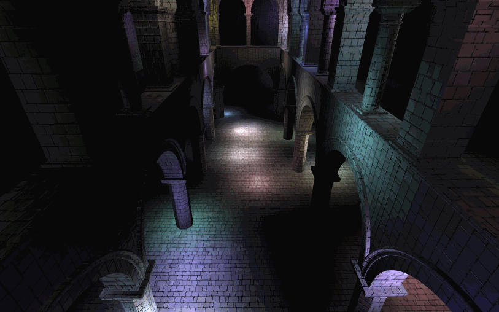
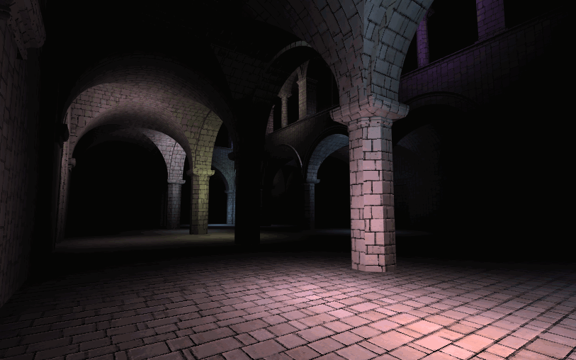
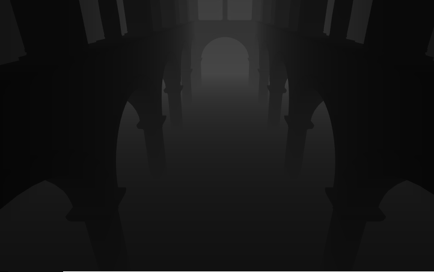

WebGL Clustered and Forward+ Shading
======================

* Salaar Kohari
  * LinkedIn ([https://www.linkedin.com/in/salaarkohari](https://www.linkedin.com/in/salaarkohari))
  * Website ([http://salaar.kohari.com](http://salaar.kohari.com))
  * University of Pennsylvania, CIS 565: GPU Programming and Architecture
* Tested on: **Google Chrome** 10/25/2018
  Windows 10, i7-8700K @ 3.7GHz 32GB, GTX 1060 6GB (Personal Computer)
  

### Live Online

### Description

### Images

Forward rendering scene with 100 dynamic lights

Forward rendering scene with 100 dynamic lights

Depth map shader

### Credits

* [Three.js](https://github.com/mrdoob/three.js) by [@mrdoob](https://github.com/mrdoob) and contributors
* [stats.js](https://github.com/mrdoob/stats.js) by [@mrdoob](https://github.com/mrdoob) and contributors
* [webgl-debug](https://github.com/KhronosGroup/WebGLDeveloperTools) by Khronos Group Inc.
* [glMatrix](https://github.com/toji/gl-matrix) by [@toji](https://github.com/toji) and contributors
* [minimal-gltf-loader](https://github.com/shrekshao/minimal-gltf-loader) by [@shrekshao](https://github.com/shrekshao)
