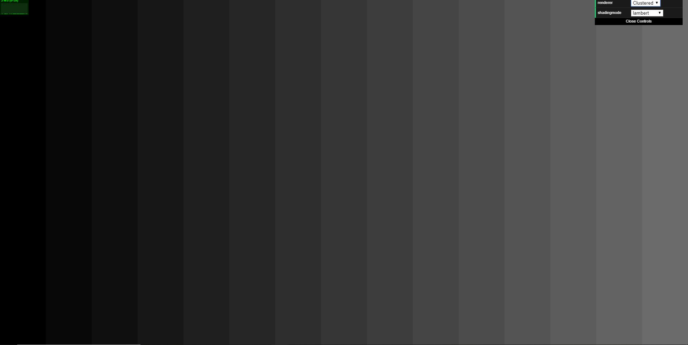

WebGL Clustered and Forward+ Shading
======================

**University of Pennsylvania, CIS 565: GPU Programming and Architecture, Project 5**

* Lan Lou
* Tested on: **Google Chrome 69.0.3497.100 (Official Build) (64-bit)** on
  Windows 10, i7-6700HQ @ 2.60GHz 16GB, GTX 1070 8GB (Personal Laptop)

## [Live Online](https://lanlou123.github.io/Project5-WebGL-Clustered-Deferred-Forward-Plus/)

note : I only wrote the shading selection for clustered rendering

## Click this gif for video link

due to gif capture sofware's limitation, the above gif which represent blinn-phong shading appear to have some ramp effects from toon.

## Sample gifs

blinn-phong|lambert|toon
----|----|----
||

# Introduction:

### forward rendering
forward shading is the most straight forward shading method, basically, it first loops through each geomery in the scene, then, inside one sigle loop for the geometry, it will do another loop of all the lights in the scene to apply light influence on the current geometry, it is esay to tell that once the number of lights is really huge, this method can suffer from terrible performance issue, which makes this rendering technique impossible to be applied to current day games as most of them possess large amount use of lighting.

### forward plus rendering
a better solution towards the issue brought by forward rendering is to use clustered structure for lighting, in forward plus, we will have the simmilar first step:loop all the geometry, but different second step, this time, we will catergorize lights into different clusters, and inside the fragment shader for each geometry loop, we will not check every light anymore, instead, we only accumulate light influence from lights that inside the cluster the geometry point is in. as a result, we will have a big improvement on performance, especially when there are a lot of lights.

### clustered deferred rendering
we can further improve the performance by introducing an extra buffer:g-buffer which contains certain amounts of 2d textures(specified by user according to need), inside the textures, we will only store the geometry displacement "on the top" or in other words have the smaller depth value compared with other fragments at same NDC coordinate, apart from that, we can also store normal, depth, albedo, as long as it is required for our rendering. 

a graph for typical deferred rendering.

according to the image above, the reason this method is better is that the lighting loop will only check the 2d texture instead of checking every geometry, and the texture only store the toppest geometry, which ensures that we won't check the lighting inluence on those geometry "behind the walls" since we are not seeing it.

### cluster structure

an example for the cluster structure would look like the above image, althogh it is simply drawed as a 2d frustum, it actually should be  a 3d one, and this one can be taken as a simplified version of the 3d one looking along y axis direction, so, the orange sphere represents the light influence area, those clusters colored as red and orange are the ones we will consider storing into the buffer of this specific light, we will store the clusters in the form of cluster start index in x,y,z directions and end index respectively. 

# Project Features:

### Forward+
  - Build a data structure to keep track of how many lights are in each cluster and what their indices are
  - Render the scene using only the lights that overlap a given cluster
  

### Clustered
  - Reuse clustering logic from Forward+
  - Store vertex attributes in g-buffer
  - Read g-buffer in a shader to produce final output

### Effects
  - Implemented deferred Blinn-Phong shading (diffuse + specular) for point lights
    - for the blinn-phong effect, I simply used the half angle method and an extra inverse viewmatrix to compute the view point
    position.
  - Implemented toon shading (with ramp shading + simple depth-edge detection for outlines)
    - toon is simple, just do an interpolation between the ramped value of lambert term and the original lambert term, the same goes for blinn-phong term ~
    

blinn-phong shading, you can notice the reflection on the floor and pillar quite clearly.

toon shading, the color is ramped based on the distance to the light center.
  

### Optimizations
  - Optimized g-buffer format - reduce the number and size of g-buffers:
    - Pack values together into vec4s
      - I stored position and normal data in vec4s
    - Use 2-component normals
      - since the length of a normal will always be 1, we don't need all three of them, I choosed to pack the normal's x and y component into the former 2 vec4s, one thing to notice is I have to multiply viewmatrix before packing , and use inverse viemat in shader do unpacking...
      
      
    

# Performance & Analysis

### Three methods comparision:

this test is done with light radius being 4, cluster size = 15X15X15, and light number gradually increasing
as the diagram explicitly shown, when the light count increases, pure forward suffers from drastic performance drop while forward+ and clustered deferred shows better score, actually, the last one: deferred is really efficient , it's performance didn't change much even if there are up to 4k lights. 

### Cluster size influence:

this test is done with 3500 light sources, light radius 4, renderer is clustered deferred.
from this image, we know that cluster size of 15X15X15 strikes the best performance, I guess this can only be aquired by fine tunning the renderer.

### pack vector vs not packed:

this test is done with 1000 light sources, renderer is clustered deferred
this apparently shows the benefit of packing 3 floats g-buffer into 2 floats g-buffer, as we reduced the number of g buffers, therefore reduced the times we read and write to g buffers.

### debug images:

xslice view|yslice view
----|-----
|

depth buffer| albedo buffer| surface normal buffer
---|---|---
||

pure light buffer

### Credits

* [Three.js](https://github.com/mrdoob/three.js) by [@mrdoob](https://github.com/mrdoob) and contributors
* [stats.js](https://github.com/mrdoob/stats.js) by [@mrdoob](https://github.com/mrdoob) and contributors
* [webgl-debug](https://github.com/KhronosGroup/WebGLDeveloperTools) by Khronos Group Inc.
* [glMatrix](https://github.com/toji/gl-matrix) by [@toji](https://github.com/toji) and contributors
* [minimal-gltf-loader](https://github.com/shrekshao/minimal-gltf-loader) by [@shrekshao](https://github.com/shrekshao)
