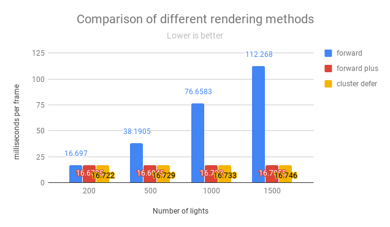
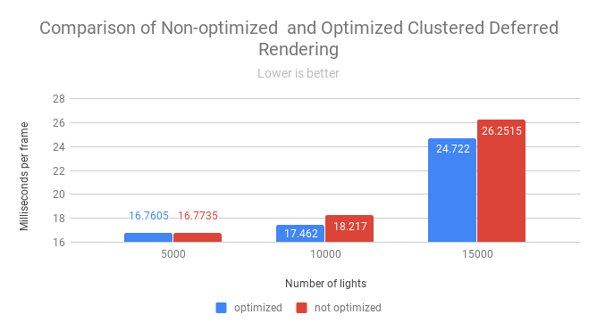

WebGL Clustered and Forward+ Shading
======================

**University of Pennsylvania, CIS 565: GPU Programming and Architecture, Project 5**

* Wanru Zhao
* Tested on: Google Chrome 70.0.3538.77 on
  Windows 10, i7-8750H @ 2.20GHz 16GB, GTX 1070 with Max-Q Design (Personal Laptop)

### Live Online

_Currently having issue with making github pages (npm run build issue)_

### Demo

**_Demo_**

  

**_Blinn-Phong_**

  
  
  

### Features

- Cluster update
  - Devide the whole frustum into **_xSclices * _ySlices * _zSlices** clusters and assign lights into overlapping clusters
- Foward+
  - Build a data structure (texture buffer) to keep track of how many lights are in each cluster with their indices
  - Render the scene using only the lights that overlap a given cluster
- Clustered
  - Reuse clustering logic
  - Store vertex attributes in g-buffer
  - Read g-buffer and render scene to produce final output
- Effect
  - Implemented deferred Blinn-Phong shading for point lights
- Optimization
  - Pack values into vec4, reduce number of g-buffers from 4 to 2, reconstructing world position using camera matrice and (gl.FragCoord.x, gl.FragCoord.y, depth)
  
### Analysis

#### Clustered deferred rending components
Albedo | Normal
:--:|:--:
|
Depth | World Position
|
Camera Position

_Those are components used to final shading in deferred rendering. Among them, albedo, normal and depth are passing through g-buffers, while world position and camera position are reconstructed from information obtained from g-buffers._

#### Performace
_(Because I have no way to turn off the VSNYC of my computer and Google Chrome, the highest fps is limited to 60 all the time. Therefore the difference between forward+, clustered deferred, and optimized clustered deferred methods.)_
##### Performance comparison of Forward, Foward+ and Clustered methods

  

From the comparison of different rendering methods' performances, we can find that as the number of lights increases, the performance of Forward rendering dramatically drops. Also, the performance of Forward rendering is worse than Forward Plus and Clustered Deferred rendering. Also, there is only slightly difference between Forward Plus and Clustered Rendering. I think this is due to what I mentioned at the beginning of this session.

##### Performace comparison of unoptimized Clustered and optimized Clustered

  

When the number of lights is large enough, performance enhancement can be seen after optimization. For this part, I used 2 g-buffers instead of initial 4 g-buffers. Also, the world position and camera space position are calculated through one depth value passed through g-buffer.

### Credits

* [Three.js](https://github.com/mrdoob/three.js) by [@mrdoob](https://github.com/mrdoob) and contributors
* [stats.js](https://github.com/mrdoob/stats.js) by [@mrdoob](https://github.com/mrdoob) and contributors
* [webgl-debug](https://github.com/KhronosGroup/WebGLDeveloperTools) by Khronos Group Inc.
* [glMatrix](https://github.com/toji/gl-matrix) by [@toji](https://github.com/toji) and contributors
* [minimal-gltf-loader](https://github.com/shrekshao/minimal-gltf-loader) by [@shrekshao](https://github.com/shrekshao)
